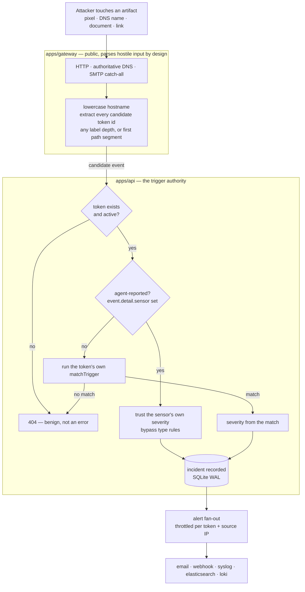
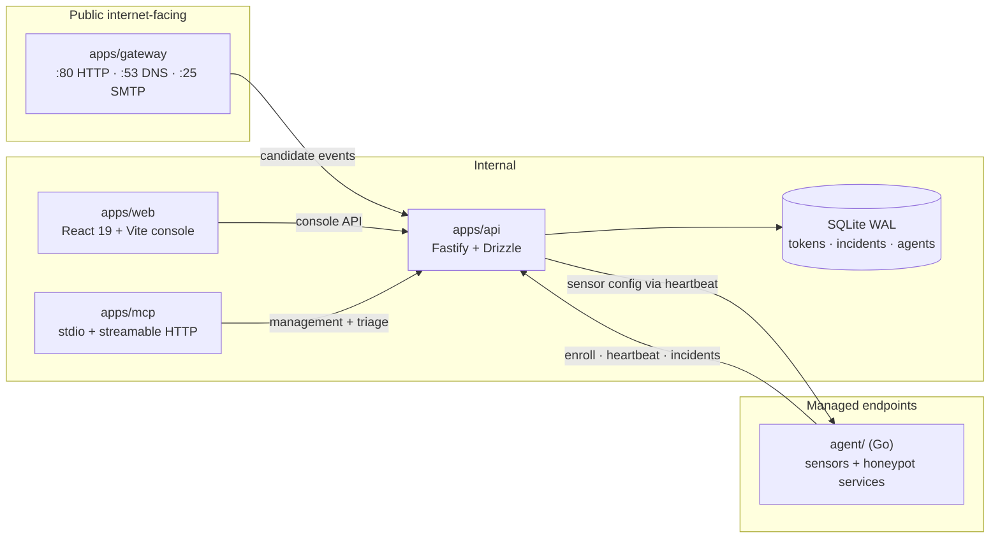
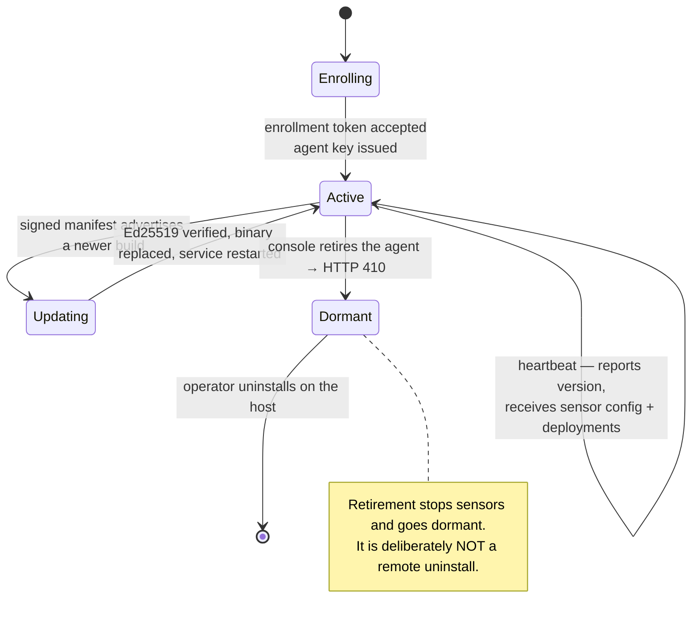

# Architecture

f0_deception is a self-hosted deception platform. It plants artifacts that
nobody legitimate has a reason to touch — a pixel in a document, a hostname in
a config file, a credential in a backup script, an SSH service on a host that
runs nothing — and turns any contact with one into an incident.

Two halves feed one pipeline:

- **Agentless canarytokens** reach back over the public internet. The artifact
  itself is the sensor; a public **gateway** catches the reach-back.
- **Endpoint agents** run full-interaction honeypots (SSH, SMB, RDP, fake HTTP
  login) and local detectors (planted credentials, file-access watches) on
  hosts you control.

Both converge on the same incident record and the same alert fan-out, so
triage does not care which half fired.

This document covers the trigger flow, the component boundaries, the agent
lifecycle, and — most importantly — the invariants, each with the reason it
exists. The rules are cheap to state and expensive to rediscover.

## Trigger flow

### The gateway forwards candidates, not verdicts

The gateway is a catch-all. It answers for the entire token domain — every
hostname beneath it, every path, every recipient address — because a token
artifact can be shaped like anything and an attacker will not send a
well-formed request out of courtesy.

Normalising that input is all the gateway does:

- **HTTP** — lowercase the `Host` header, strip the base domain, split what
  remains into labels, and treat *every* label as a candidate token id. For
  apex-hosted artifacts (documents embed `https://tokens.example.com/<id>/pixel.gif`)
  the first path segment is a candidate too.
- **DNS** — same label extraction on the lowercased query name. The gateway is
  authoritative for the token domain and answers a fixed A record; anything
  outside its domains is `REFUSED`, because it is not a resolver.
- **SMTP** — the local part of each accepted `RCPT TO` on a mail domain.

Nothing in that list is a decision about whether an event *is* a trigger. The
gateway holds no database. It does not know which ids exist, which are active,
or what type any of them is. It applies one coarse shape filter — does this
event look like a trigger for *any* registered token type — and forwards
everything that survives. That filter cannot do attribution, because
attribution requires knowing the token's type, and only the API knows that.

### The API is the trigger authority

`POST /api/v1/incidents` looks the id up, requires the token to be **active**,
and then runs the `matchTrigger` belonging to *that token's own type*. The
severity written to the incident comes from that match. The `severity` the
gateway sent along is not used for gateway-sourced events — it is a hint from
a component that does not know the answer.

The practical consequence: a request for `/<id>/pixel.gif` fires only if that
id is a web-bug-shaped token. The same id under a `custom_image` token does not
fire on `pixel.gif`, and vice versa. One id, one type, one set of rules, and
the rules live next to the code that generated the artifact.

### A 404 is a normal outcome

There are two 404 paths above and **neither is an error**:

- **No active token for that id** — the candidate was never a token, or was one
  and has been paused, revoked, or deleted.
- **Event does not match this token's triggers** — a live id was touched in a
  way its type does not consider a hit.

A public catch-all on the internet receives a constant stream of traffic that
has nothing to do with any token: port scanners, certificate-transparency
crawlers, resolver probes, opportunistic bots walking `/wp-login.php`, links
that outlived the token behind them. Every one of those produces a candidate,
and every candidate that is not a live trigger produces a 404. That is the
system working — the noise floor is being rejected exactly where it should be.

The gateway therefore treats `404` as success and logs nothing. Any *other*
non-2xx response is a genuine fault — a misconfigured shared secret, an API
that is down — and is logged loudly. If 404s were alarms, the alert stream
would be a feed of internet background radiation, and the real alerts would be
buried in it. **A high 404 count on the gateway is not a symptom.** If you are
debugging a token that will not fire, the useful signal is a `401`/`403`, or
the absence of any forwarded request at all.

### The agent branch

An event carrying `event.detail.sensor` is an agent-reported detection and
bypasses the type rules, keeping the severity the sensor assigned. This is not
a shortcut: an SSH honeypot capturing a credential attempt or an SMB sensor
capturing an NTLM exchange has no artifact URL for a token type's rules to
match against. The sensor observed the interaction directly and is the only
component that can grade it.

Agent detections still report against a **managed token id**, so a honeypot hit
lands on the same revocable, alertable, filterable entity as a canarytoken hit.

### After the match

The incident is written to SQLite (WAL) with the full event JSON as the
authoritative record. The source IP is extracted once at ingest and, if a
MaxMind-format database is configured, enriched with geo data — enrichment
failure never blocks ingest.

Alert dispatch is fire-and-forget once the incident is durable, and throttled
per `(token, source IP)` pair. Without that throttle, one attacker refreshing a
cloned login page would generate one alert per request, and the first genuinely
interesting event would arrive on page four of an inbox.

## Components

### The gateway is the only thing that should face the internet

It publishes three listeners in production: `:80` for artifact delivery and
HTTP reach-backs, `:53/udp` as the authoritative nameserver for the delegated
token zone, and SMTP for email tokens. (Local runs default to unprivileged
`8080`/`5353`/`2525` via `F0_HTTP_PORT`/`F0_DNS_PORT`/`F0_SMTP_PORT`; email
tokens triggered by arbitrary internet senders need the real `:25`, since no
sender will retry on an alternate port.)

The gateway is the only component whose input is attacker-controlled, so it is
the only one built under those rules: no shelling out, no mapping of request
paths onto the filesystem, size caps on every input, all enforced by semgrep
rules that block CI. Keeping that surface to exactly one process is the point —
every other component gets to assume its input came from something that already
authenticated.

The gateway also holds almost nothing worth stealing. No database, no console
credentials. It carries one shared secret (`F0_INTERNAL_SECRET`) whose scope is
*only* incident forwarding and internal artifact lookups; that credential is
deliberately rejected on console routes, so gateway compromise does not become
console compromise.

### Everything else is internal

The **API** is the source of truth for tokens, incidents, agents, alert
channels, and keys, over Fastify + Drizzle + SQLite in WAL mode. Single-file
storage is a deliberate deployment choice: the whole system is meant to be a
`docker compose up` and a volume, not a database tier.

The **console** is private by default — bound to loopback and reached over an
SSH tunnel — with publishing it on `:443` behind ACME as an explicit opt-in.
The gateway keeps public `:80` in every configuration, because token reach-backs
must arrive unproxied for the source IP to mean anything.

The **MCP server** is the same management and triage surface exposed to an LLM
over stdio or streamable HTTP. It calls the API like any other client and gets
no privileges the console does not have. Its tool schemas come from the same
zod definitions the API validates against (`packages/shared`), so the two can
never drift into disagreeing about a shape.

### Endpoints dial out; nothing dials in

Agents enroll, heartbeat, and report to the API. The API never opens a
connection to an endpoint, which is what makes the fleet workable across NAT,
laptops, and segmented networks without inbound firewall rules.

Sensor configuration therefore travels *down* the heartbeat, from the
`agent_sensors` table — not from environment variables or a config file on the
host. The console is the source of truth for what a host is running: an
operator changes a honeypot's port in the UI and the change lands on the next
beat, with no per-host redeploy. It also keeps the map of your detection layout
in the console rather than in a file sitting on the box an intruder is standing
on. One-shot token deployments ride the same channel — pending work goes out on
the next heartbeat, and results come back on a *later* one, never the same one.

## Agent lifecycle

**Enrolling.** The agent presents a bootstrap enrollment token — either the
environment-configured one or a managed, hash-stored, optionally expiring token
minted in the console — and receives an agent id and a long-lived agent key.
Re-enrolling the same host replaces its key rather than creating a duplicate.
The resulting state is stored machine-wide, not per-user: enrollment is run by
an interactive administrator while the service runs as a system account, and
per-user state leaves the service permanently "not enrolled".

**Active.** Each heartbeat reports the running version and receives the poll
interval, the sensor set, and any pending deployments. The agent restarts its
sensors only when the delivered set actually differs — and the comparison
includes each sensor's *config*, not just its kind and enabled flag, because a
port or path edit changes neither of those and would otherwise leave the host
running yesterday's configuration while the console displayed today's.

**Updating.** When `F0_UPDATE_MANIFEST_URL` is set, the agent fetches a release
manifest, verifies an Ed25519 signature against a public key compiled into the
binary, and only then swaps itself and restarts. Verification is over a
*canonical* serialisation of the manifest that the signer and the agent
reproduce byte-for-byte; both sides are locked by golden tests, and changing
the encoding on one side alone silently breaks every deployed agent's ability
to update.

**Dormant.** Retiring an agent from the console deletes its row, and its next
heartbeat gets a definitive `410 Gone`. The agent stops its sensors and idles.

The `410`/`401` distinction is deliberate. A `401` might be a transient fault or
an orphaned process superseded by a re-enrollment, so the agent keeps retrying.
A `410` is the console stating that this agent is decommissioned, which is the
only signal that justifies shutting honeypots down — a host still listening on
a honeypot port while every detection is rejected upstream looks defended and
is not.

Retirement stops there, on purpose. It is **not** a remote uninstall:

- A compromised console must not be able to wipe a fleet, and with it the
  evidence of what happened.
- An API restored from an older backup will not recognise agents enrolled after
  the snapshot. Under a remote-uninstall design, a routine restore would silently
  disarm healthy hosts.
- Dormancy is recoverable — re-enroll and the host is back. Deletion is not.

The dormant agent also stays resident rather than exiting, so the service
manager does not restart it into a crash loop that scrolls the one log line
explaining what happened off the screen. Removing it is a local action:
`--uninstall` on the host.

## Invariants

These are load-bearing. Each has cost a debugging session at least once.

**1. Token ids are lowercase-only, from `23456789abcdefghjkmnpqrstuvwxyz`.**
DNS is case-insensitive and the gateway lowercases every hostname and query
name before extracting candidates, so an id containing an uppercase character
could never match the id stored in the database — the token would be
undetectable rather than obviously broken. The alphabet also omits `0`, `1`,
`i`, `l`, and `o`, because token ids get read off screens, typed into config
files, and embedded in documents by hand.

**2. A token id may sit at any label depth under the base domain, or in the
first URL path segment.** Attackers and the software they touch mangle
hostnames: a resolver may prepend labels, a mail system may qualify a name, a
document viewer may fetch a subresource. Pinning the id to the leftmost label
would make a trigger's detectability depend on someone else's string handling.
So the gateway forwards *every* label as a candidate, plus the first path
segment for apex-hosted artifacts (a document embeds
`https://tokens.example.com/<id>/pixel.gif`, not a per-token hostname). Ids that
are not live tokens are dropped by the API — which is precisely why 404s are
expected in gateway logs rather than alarming.

**3. Token artifacts are DB-backed (`token_files`, base64), never filesystem
paths.** The gateway serves attacker-chosen paths, so any mapping from a
request path onto the filesystem is a traversal bug waiting to be written.
Storing artifacts as rows removes the category: there is no path to normalise,
no symlink to follow, no directory to escape. It also makes tokens portable —
a backup of the database is a complete backup of every artifact — and lets the
stateless gateway be redeployed or replicated freely. This is enforced, not
merely intended: semgrep rules block filesystem access driven by request data.

**4. Agent-reported incidents bypass type rules and carry their own severity.**
An event with `event.detail.sensor` set is a full-interaction detection: a
credential attempt against an SSH honeypot, an NTLM exchange with an SMB
sensor, a read of a planted credential file. There is no artifact URL for a
token type's `matchTrigger` to inspect, and the sensor is the only component
that saw enough to grade the event. It still reports against a managed token
id, so honeypot detections stay attached to a revocable, alertable entity
instead of becoming a second, parallel class of incident.

**5. Sensor config is fleet-managed through `agent_sensors` and delivered by
heartbeat.** Endpoint-local configuration would have to be reapplied host by
host, would drift silently, and would place a description of your detection
layout on the machine an intruder is most likely to be reading. The console
owns the intent; the endpoint asks what to run. A corollary the API enforces:
every sensor must reference an active token id — a sensor without one detects
into a void, because ingest rejects an incident with an empty token id. Rows
saved without a token get a `honeypot` token provisioned automatically, and a
row naming a missing or inactive token fails the whole save.

**6. Agent retirement is dormancy, not remote uninstall.** A console that can
delete agents remotely is a console whose compromise wipes the fleet and
destroys the evidence of the intrusion, and an API restored from an older
backup would disarm every agent enrolled since the snapshot. Retirement stops
sensors and idles; removal is a local, deliberate act on the host.

**7. Adding a token type is one file in `packages/tokens-core/src/` plus
registration — and its `matchTrigger` must mirror the artifact paths served by
`apps/gateway/src/artifacts.ts`.** Each type is a single
`TokenTypeDefinition` — `configSchema`, `generate()`, `matchTrigger()` — so
generation and detection are written together and reviewed together. The
mirroring requirement is the sharp edge: the gateway serves the artifact and
the API decides whether touching it was a trigger, and if those two disagree
the token is *silently* undetectable. It serves its pixel, it 404s the
incident, and nothing anywhere reports a fault. Every new type needs
registry-side match tests plus a live end-to-end trigger before it can be
trusted. Registering a type also means updating it in four places: the shared
enum, the tokens-core definition and registry, the console's type list, and the
MCP tool enum.

Two more that are conventions rather than mechanisms, but break things just as
effectively: cross-app data shapes live only in `packages/shared` zod schemas
(the API and the MCP server validate against the same definitions and cannot
drift), and configuration comes from `F0_*` environment variables with no
secrets in code.

## Where to look

| Question | File |
|---|---|
| How is a candidate extracted from a request? | `apps/gateway/src/http.ts`, `dns.ts`, `smtp.ts` |
| Which candidates get forwarded? | `apps/gateway/src/server.ts` |
| What does an artifact actually serve? | `apps/gateway/src/artifacts.ts` |
| Is this event a trigger? | `apps/api/src/routes/tokens.ts` (`POST /api/v1/incidents`) |
| What are the token types? | `packages/tokens-core/src/registry.ts` |
| How are alerts throttled and dispatched? | `apps/api/src/alerts/dispatcher.ts` |
| What does an agent do on each beat? | `agent/main.go`, `apps/api/src/routes/agents.ts` |
| What shapes cross app boundaries? | `packages/shared/src/` |
