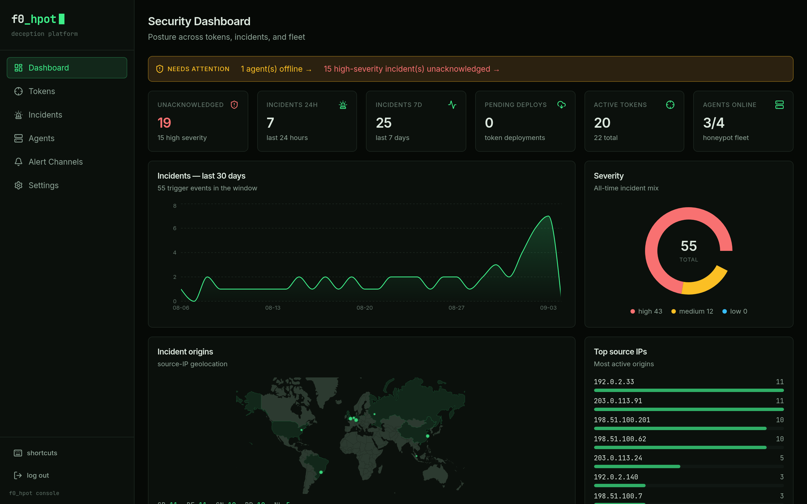

# f0_hpot

**Self-hosted deception platform.** Plant canarytokens that phone home when
touched, and run full-interaction honeypots on your endpoints — without
sending a single detection to someone else's cloud.

[](https://github.com/ubercylon8/f0_hpot/actions/workflows/ci.yml)
[](LICENSE)




> **Status:** pre-1.0 and self-hosted. All 16 token types, the management
> console, the endpoint agent fleet and MCP-based triage are working and in
> production use. Interfaces may still change between minor versions.

## What it is

A deception platform plants things nobody legitimate has a reason to touch —
a pixel in a document, a hostname in a config file, an AWS key in a backup
script, an SSH service on a host that runs nothing — and turns any contact
with one into an incident. There are no signatures to tune and no baseline to
learn: the alert *is* the detection.

f0_hpot runs two halves into one pipeline:

- **Agentless canarytokens** reach back over the public internet. The artifact
  itself is the sensor, and a public gateway catches the reach-back.
- **Endpoint agents** run full-interaction honeypots (SSH, SMB, RDP, fake HTTP
  login) and local detectors (planted credentials, file-access watches) on
  hosts you control.

Both converge on the same incident record and the same alert fan-out, so
triage does not care which half fired. The gateway forwards *candidates*, never
verdicts: every gateway-forwarded event has to satisfy the token type's own
match rules at the API before it becomes an incident, and the severity comes
from that match. Agent detections take the other branch — a sensor that watched
an SSH credential attempt has no artifact URL to match on, so it reports
against a managed token id and carries its own severity.
[ARCHITECTURE.md](ARCHITECTURE.md) walks the whole flow and the invariants
behind it.

## What ships

| Component | State |
|---|---|
| `apps/gateway` | Public trigger catcher — HTTP catch-all, authoritative DNS, SMTP. The only thing that *should* face the internet, and the only component whose input is attacker-controlled. |
| `apps/api` | Trigger authority and source of truth: tokens, incidents, agents, alert channels, API keys. Fastify + Drizzle + SQLite (WAL). |
| `apps/web` | React 19 + Vite + Tailwind console: dashboard, tokens, incidents, agents, alert channels, settings. |
| `apps/mcp` | MCP server over stdio and streamable HTTP — 8 management and triage tools for an LLM client. |
| `agent/` | Go endpoint agent: enroll, heartbeat, fleet-managed sensors. Runs as a systemd unit or a Windows SCM service, with Ed25519-signed self-update and a 5-platform cross-build. |
| `packages/tokens-core` | The 16 token types, each a single `TokenTypeDefinition` pairing `generate()` with the `matchTrigger()` that detects it. |
| `packages/shared` | zod schemas for shapes that cross app boundaries — validated against by the API and the console. |

**16 token types** ([reference](docs/TOKEN-TYPES.md)): `web_bug`,
`custom_image`, `dns`, `email`, `qr_code`, `fast_redirect`, `cloned_website`,
`word_doc`, `excel_doc`, `pdf_doc`, `windows_folder`, `sensitive_cmd`,
`sql_injection`, `aws_keys`, `azure_config`, `honeypot`.

**6 agent sensor kinds:** `ssh`, `http_login`, `smb_share`, `rdp_banner`,
`planted_credential`, `file_watch` — configured from the console and
delivered down the heartbeat, never from a config file on the endpoint.

**5 alert channel kinds:** `webhook`, `syslog`, `email`, `elasticsearch`,
`loki`, throttled per (token, source IP). Webhook and syslog are verified
live; email needs an SMTP relay you supply; the Elasticsearch and Loki
senders have been asserted at the wire-format level against mock sinks
rather than real clusters. Slack and Teams webhook URLs will **reject** the
payload as shipped and need a small transformer in front.
[docs/ALERTING.md](docs/ALERTING.md) is blunt about each one.

## How it compares

**Versus commercial canary appliances.** The trade is control for
convenience, and it genuinely cuts both ways.

| | f0_hpot | Commercial appliance |
|---|---|---|
| Where detections land | Your database, your VPS | The vendor's cloud |
| Cost per token | None | Per-bird / per-token licensing |
| Who knows your estate | You | The vendor holds a map of your decoys |
| Source | Apache-2.0, auditable | Closed |
| Support | GitHub issues, no SLA | Contract, vendor SLA |
| Ops burden | Yours: patching, uptime, backups | Theirs |
| Hardware & mature integrations | Software only | Shipped, polished, broad |

**Versus free hosted canarytoken services.** These are excellent, and for a
one-off token they are the right answer — you get a working token in two
minutes with no VPS, no DNS delegation, no upkeep and no cost. That is a real
advantage and it does not go away because you self-host.

| | f0_hpot | Free hosted service |
|---|---|---|
| Setup | VPS, a domain, NS delegation | None — open a web page |
| Ongoing cost & upkeep | A VPS and your time | Zero |
| Token domain | Yours, unremarkable in logs | Shared, publicly known, greppable by an attacker |
| Incident data | Stays on your host | On shared infrastructure |
| Endpoint honeypots | SSH / SMB / RDP / HTTP-login sensors | Not offered |
| Fleet management | Console-managed agents | n/a |
| SIEM forwarding | Syslog, Elasticsearch, Loki, webhook | Email, mostly |
| Licensing | No per-token licensing | Free, but on someone else's terms |

If you want one canary in a document this afternoon, use a hosted service. If
you want a hundred decoys across an estate, on your own domain, feeding your
own SIEM, that is what this is for.

## Quickstart

Node ≥ 22 and pnpm. Nothing here needs root or a public domain — the
platform runs on high ports and tokens trigger from the same machine.

```sh
git clone https://github.com/ubercylon8/f0_hpot && cd f0_hpot
pnpm install && pnpm build
```

Terminal 1 — the API:

```sh
cd apps/api
F0_DB_PATH=/tmp/f0-demo.db F0_API_PORT=18443 \
F0_GATEWAY_ORIGIN=http://localhost:18080 \
F0_TOKEN_DOMAINS=localhost,tokens.example.com \
  npx tsx src/server.ts
```

Terminal 2 — the gateway:

```sh
cd apps/gateway
F0_API_BASE_URL=http://127.0.0.1:18443 \
F0_HTTP_PORT=18080 F0_DNS_PORT=15353 \
F0_TOKEN_DOMAINS=localhost,tokens.example.com \
F0_GATEWAY_ORIGIN=http://localhost:18080 \
  npx tsx src/server.ts
```

Both must agree on `F0_TOKEN_DOMAINS`, and `localhost` has to be **first** in
the list: the API builds every artifact from the first entry, so anything else
in front of it produces tokens pointing at a name you cannot reach. With no
`F0_ADMIN_TOKEN` set and no API keys created, the API logs a loud warning and
runs unauthenticated — fine for this demo, not for anything reachable.

Terminal 3 — plant a token and trip it:

```sh
curl -s -X POST localhost:18443/api/v1/tokens \
  -H 'content-type: application/json' \
  -d '{"type":"web_bug","memo":"quickstart"}'
```

```json
{"id":"u6p3gp9n3bwx","type":"web_bug","status":"active",
 "artifacts":[{"kind":"url","label":"Tracking pixel URL",
   "value":"http://localhost:18080/u6p3gp9n3bwx/pixel.gif"}]}
```

That URL is the canary. Fetch it the way an attacker's document viewer would:

```sh
curl -s -o /dev/null http://localhost:18080/u6p3gp9n3bwx/pixel.gif
curl -s localhost:18443/api/v1/incidents
```

```json
[{"id":"inc_mtm9vm4yvq4ogu","tokenId":"u6p3gp9n3bwx","tokenType":"web_bug",
  "severity":"medium","acknowledged":false,
  "event":{"kind":"http","sourceIp":"::1",
    "http":{"method":"GET","host":"localhost",
      "path":"/u6p3gp9n3bwx/pixel.gif","userAgent":"curl/8.21.0"}},
  "seenAt":"2026-09-04T01:25:45.298Z"}]
```

That is a real detection: the gateway caught the request, the API confirmed it
against the `web_bug` type's own rules, graded it, and recorded it.

DNS tokens work the same way against the gateway's resolver. Creating one
returns a `Trigger hostname` artifact built from the first token domain —
`<id>.localhost` here — and resolving it fires a `high`-severity incident:

```sh
dig +short -p 15353 @127.0.0.1 <id>.localhost
```

For the console:

```sh
cd apps/web && F0_API_PORT=18443 npx vite   # http://localhost:5173
```

`F0_API_PORT` has to match the API's port — the dev server proxies `/api` to
it. Email tokens are the one thing that will not work locally: internet
senders only deliver on port 25.

## Production

A real deployment needs three things:

- A **public VPS** with ports 80/443 (artifacts and console), 53/udp (DNS
  tokens) and 25 (email tokens).
- A **domain you control**, e.g. `tokens.example.com`.
- **NS delegation** of that token subdomain to the host — `NS
  tokens.example.com → ns1.tokens.example.com` plus a glue
  `A ns1.tokens.example.com → 203.0.113.10`. No wildcard record: the gateway
  is authoritative and answers every name under the zone.

The console binds to loopback and is meant to be reached over an SSH tunnel;
publishing it behind TLS is an explicit opt-in. Full walkthrough, including
Docker Compose and the agent fleet, is in [docs/INSTALL.md](docs/INSTALL.md).

## Documentation

- [ARCHITECTURE.md](ARCHITECTURE.md) — trigger flow, component boundaries,
  agent lifecycle, and the invariants with the reason each exists.
- [docs/INSTALL.md](docs/INSTALL.md) — local test setup and production VPS deploy.
- [docs/USER-GUIDE.md](docs/USER-GUIDE.md) — day-to-day: plant tokens, read
  alerts, run honeypots.
- [docs/TOKEN-TYPES.md](docs/TOKEN-TYPES.md) — all 16 types: what each plants,
  what trips it, how it is scored, where to deploy it.
- [docs/AGENT-GUIDE.md](docs/AGENT-GUIDE.md) — enrollment, sensor kinds,
  self-update, retirement, and three limitations to know before relying on it.
- [docs/ALERTING.md](docs/ALERTING.md) — channels, payload, throttling, and
  which integrations are proven versus merely asserted.
- [docs/HARDENING-LOG.md](docs/HARDENING-LOG.md) — a self-audit of a live
  deployment: every defect found, paired with the commit that fixed it.
- [CONTRIBUTING.md](CONTRIBUTING.md) — setup, the gate list a PR must pass.
- [SECURITY.md](SECURITY.md) — reporting a vulnerability.
- [CODE_OF_CONDUCT.md](CODE_OF_CONDUCT.md) — community expectations.

## Responsible use

This software runs honeypots that capture credentials supplied by whoever
touches them. Deploy it only on infrastructure you control, and read
[SECURITY.md](SECURITY.md) before you do.

## License

Apache-2.0 — see [LICENSE](LICENSE).
