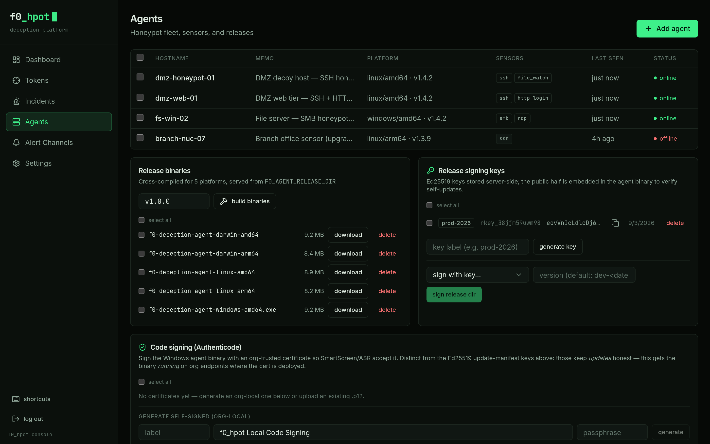

# Agent Guide

`agent/` is a Go binary that enrolls with the console, sends a periodic
heartbeat, and runs whatever sensors the console has configured for it. This
guide covers enrollment, the sensor kinds, how configuration reaches a
running agent, self-update, and retirement — including three limitations you
should know about before you rely on any of this in production.

## Read this first: three limitations

**1. Bait *reads* cannot be detected on most modern Windows hosts.**
NTFS last-access timestamp updates are disabled by default on current
Windows releases (`fsutil behavior query DisableLastAccess` typically
reports `2 (System Managed, Disabled)`). Both `planted_credential` and
`file_watch` detect a read by watching a file's access time move; if the
filesystem never updates it, a read is indistinguishable from doing
nothing. **Only `planted_credential` protects you from that silently.**
Rather than assume the caveat applies from the OS alone, it **probes it
empirically at startup** — it arms the bait file, reads it, and checks
whether the timestamp moved (`readsAreDetectable` in
`agent/internal/sensors/planted.go`, backed by the platform-specific
`atimeOf` in `agent/internal/sensors/atime_windows.go` /
`atime_linux.go` / `atime_bsd.go`). When reads won't register, it logs a
warning naming the fix (`fsutil behavior set disablelastaccess 0` on
Windows; check for a `noatime` mount on Linux) instead of silently
pretending to watch. Writes and deletions of the bait file are still
detected either way.

`file_watch` has **no such probe and logs no such warning**. It calls the
same platform `atimeOf` helper inside its polling loop, so it shares the
identical blind spot on a host where last-access updates are disabled or
the filesystem is mounted `noatime` — but nothing checks for that
condition at startup, and nothing tells you it's happening. Point
`file_watch` at a credential store on such a host and reads of it go
undetected with no indication in the log that anything is wrong. Treat
this as read-detection support you must confirm yourself (for example,
by checking `fsutil behavior query DisableLastAccess` or the mount
options on the target file ahead of time), not something the sensor will
warn you about.

**2. Retiring an agent from the console is not a remote uninstall.** It
stops the agent's sensors and leaves it dormant. `DELETE
/api/v1/agents/:id` deletes the agent's row (and its sensor rows); the
agent's key dies with it, so its next heartbeat gets `HTTP 410` instead of
a normal response (see `apps/api/src/routes/agents.ts`). The agent (`agent/main.go`)
treats 410 as "revoked": it stops every running sensor and then blocks
indefinitely rather than exiting, so a service manager cannot crash-loop it
back into the same state. It deliberately does **not** remove itself — a
compromised console being able to erase agents and their evidence remotely
would be worse than an idle process. Actually removing the agent from a
host is a separate, local action: run the same binary with `--uninstall`
(removes the systemd unit on Linux, or the Windows service via the SCM).
To bring a retired agent back into service, re-enroll it: `--server <url>
--enroll <token>`.

**3. A sensor needs a reporting token; you don't have to supply one.**
Every sensor kind reports its detections against a token id. A sensor
config with no `token_id` used to run, listen, and detect — and be heard
from nowhere, because the incident-ingest endpoint rejects an empty token
id. `PUT /api/v1/agents/:id/sensors` now resolves this at save time
(`apps/api/src/routes/agents.ts`): if a sensor's `config.token_id` is
missing or blank, the API provisions a `honeypot`-type token for it in the
same transaction (memoed `<hostname> · <sensor kind>`) and stores that id
back into the sensor's config. If you *do* supply a `token_id`, it must
name an existing, active token, or the whole sensor-set save is rejected
with a 400 — the field exists so several sensors can deliberately share
one token, not so you have to mint one by hand for every sensor.



## Enrollment

An agent needs a server URL and an enrollment token to register. Two kinds
of enrollment token work:

- A single static token from the `F0_ENROLLMENT_TOKEN` environment
  variable on the API — simple, but shared by every install and only
  revocable by rotating the env var.
- A **managed enrollment token** (`f0et_...`), created from the console.
  These are per-installation, labeled, optionally expiring, and tracked
  (use count, last-used time) — and can be deleted individually to revoke
  just that install (`apps/api/src/enrollment.ts`).

`POST /api/v1/agent/enroll` accepts either kind, checks it, and returns an
`agent_id` plus a per-agent `agent_key` (re-enrolling the same hostname
replaces its key rather than creating a duplicate row). The console's
"add agent" screen renders this as a copyable one-liner using whichever
token you generated, for example:

```sh
# Linux
curl -fLO -H 'authorization: Bearer <enrollment-token>' \
  https://console.example.com/api/v1/agent-releases/f0-deception-agent-linux-amd64 \
  && chmod +x f0-deception-agent-linux-amd64 \
  && sudo ./f0-deception-agent-linux-amd64 \
       --server https://console.example.com --enroll <enrollment-token> --install
```

```powershell
# Windows (elevated PowerShell)
.\f0-deception-agent-windows-amd64.exe --server https://console.example.com `
  --enroll <enrollment-token> --install
```

`--install` does the platform-appropriate thing and then exits — it does
not itself run the agent loop:

- **Linux** (`agent/install_linux.go`): writes a systemd unit to
  `/etc/systemd/system/f0-deception-agent.service` and runs `systemctl
  daemon-reload && systemctl enable --now f0-deception-agent`. The unit
  hardens the process (`NoNewPrivileges=yes`, `ProtectSystem=full`) while
  leaving the state directory and the binary's own directory writable —
  the latter because self-update replaces the executable in place, and a
  read-only binary directory makes that impossible.
- **Windows** (`agent/install_windows.go`, `agent/service_windows.go`):
  connects to the Windows Service Control Manager and creates a real
  service running as `LocalSystem`, with automatic-restart recovery
  actions (10s/30s/60s backoff on crash). Re-running `--install` replaces
  an existing installation rather than failing, so the one-liner is
  idempotent. The running binary detects it was launched by the SCM and
  answers service control requests (`isWindowsService()` /
  `runAsService()` in `agent/main.go`) instead of running as a plain
  foreground process.

Uninstalling either service is `--uninstall` on the same binary.

## Sensor kinds

Six sensor kinds are registered (`agent/main.go`, `sensors.Register(...)`).
Each is looked up by its `kind` string, which must match exactly what the
console sends — an unrecognized kind is logged and skipped rather than
failing the whole agent (`agent/internal/sensors/sensors.go`).

Every sensor's `config` also carries a `token_id` (see limitation 3 above),
in addition to the fields below. All config values are read defensively —
a missing or wrong-typed field falls back to a default rather than
crashing the sensor.

| Kind | File | Config fields | Notes |
|---|---|---|---|
| `ssh` | `agent/internal/sensors/ssh.go` | `port` (default `2222`), `banner` (default `SSH-2.0-OpenSSH_9.6`) | Accepts *any* password for *any* user — that's the point — and captures the attempted credentials plus, on interactive login, the command and environment. |
| `http_login` | `agent/internal/sensors/httplogin.go` | `port` (default `8081`), `app_name` (default `Router Admin`), `alert_on_get` (bool, default `false`) | Serves a fake login form; a `POST /login` always reports the attempt and returns 503. With `alert_on_get: true`, a plain page view alerts too — off by default so a scanner's GET doesn't also fire. |
| `smb` | `agent/internal/sensors/smb.go` | `port` (default `445`) | Protocol-aware: parses the NetBIOS session header and SMB negotiate request and replies with a minimal SMB2 negotiate response advertising NTLM, so a scanner proceeds far enough to be worth logging. Full NTLM credential capture is future work. |
| `rdp` | `agent/internal/sensors/rdp.go` | `port` (default `3389`) | Parses the X.224 connection request (client version, requested protocols, and — for some clients — the username via a cookie routing token) and replies with a connection confirm. Full TLS/NLA credential capture is future work. |
| `planted_credential` | `agent/internal/sensors/planted.go` | `path` (**required**), `label` (default: `path`), `content` (default: a canned bait file), `interval_seconds` (default `5`) | Writes a bait file (creating parent directories as needed) if it doesn't already exist, then polls its access/modification signature. Any access — read or write — reports a high-severity trigger; a deletion reports once and the sensor stops (re-plant to resume). Subject to limitation 1 above. |
| `file_watch` | `agent/internal/sensors/filewatch.go` | `path` (**required**), `label` (default: `path`), `interval_seconds` (default `5`), `watch_atime` (bool, default `true`) | Watches an *existing* file you did not create (`/etc/shadow`, a browser cookie store, a KeePass database) for any change to its modification time, and — unless `watch_atime` is set to `false` — its access time. Same read-detection caveat as `planted_credential`. |

### Server personas (`smb` and `rdp`)

A persona (`agent/internal/sensors/persona.go`) is a coherent bundle of
everything the `smb` and `rdp` sensors advertise about the host they are
pretending to be — native OS string, NetBIOS/LanMan version fields, and
DNS suffix — so that no one wire field can contradict another (the defect
this replaced was a Samba server reporting a Windows build number that
never existed, with its NetBIOS domain equal to its own computer name).
`Resolve(cfg, kind)` builds an `Identity` from three config keys, each
read defensively with a default:

- `persona` — which shipped persona to use; defaults to
  `windows-server-2019`.
- `domain` — the NetBIOS/DNS domain the host claims to belong to;
  defaults to `WORKGROUP`.
- `hostname` — the host's own name; defaults to the agent's own
  hostname.

Four personas ship (`Personas()` in `persona.go`): `windows-server-2019`,
`windows-server-2022`, `windows-11`, and `samba-ubuntu-2204`. The Samba
persona sets no version block at all (`HasVersion: false`), matching real
Samba, which never sends `NTLMSSP_NEGOTIATE_VERSION`. An unrecognized
`persona` value falls back to the default and logs a message rather than
failing the sensor.

Setting `domain` to a real Active Directory domain name is what makes
these honeypots convincing inside an enterprise: a server claiming
membership in a domain that is not the intruder's own is discounted
immediately, while `windows-server-2019` inside `WORKGROUP` reads as
just another unmanaged box.

One limitation is intentional and recorded here so it isn't "fixed" by
accident: Windows has shipped with SMB1 disabled by default since 2017,
so a host that answers SMB1 while claiming a modern Windows persona is
mildly implausible. The SMB1 path (`agent/internal/sensors/smb1.go`)
exists deliberately anyway, because it is what captures NTLMv1 responses
from legacy clients that still speak it.

### Known protocol gaps

Three defects in the SMB and NTLM wire encodings are known and deliberately
deferred, not overlooked. All three predate the persona work. They are
recorded here because a honeypot whose whole premise is "no wire field may
lie about another" should not keep its own known lies in a private file.

- **SMB2 negotiate response field layout is off by eight bytes.**
  `buildSMB2NegotiateResponse` (`agent/internal/sensors/smb.go`) writes
  `SecurityBufferOffset`/`SecurityBufferLength` at body offsets 48 and 50,
  where MS-SMB2 2.2.4 places `ServerStartTime`; the real fields at 56 and 58
  are left zero. A conformant client therefore sees no security buffer.
  Capture still works, because clients send their own NTLM NEGOTIATE
  regardless of what the negotiate response advertises.
- **The SMB1 legacy negotiate response omits `DomainName`.** The spec
  (MS-CIFS 2.2.4.52.2) puts a null-terminated `DomainName` after the
  challenge key; `agent/internal/sensors/smb1.go` sends only the key. If it
  is added it should carry the identity's NetBIOS domain (`id.NBDomain`),
  not a constant.
- **The NTLM CHALLENGE sets neither `TARGET_TYPE_DOMAIN` nor
  `TARGET_TYPE_SERVER`.** Real servers set one of the two to describe what
  `TargetName` holds; `BuildChallenge` (`agent/internal/sensors/ntlm.go`)
  sets neither.

## Configuration delivery and generation restarts

Sensor configuration is fleet-managed from the console, not from local
files or environment variables on the host. `PUT
/api/v1/agents/:id/sensors` replaces the agent's sensor rows in the
database; every subsequent `POST /api/v1/agent/heartbeat` response
includes the current sensor list (kind, enabled, config) alongside the
poll interval and any pending one-shot token deployments
(`apps/api/src/routes/agents.ts`).

On each heartbeat, the agent deep-compares the delivered sensor set against
what it's currently running — kind, `enabled`, and the full config object,
not just kind and enabled (`specsEqual` in `agent/main.go`; a config-only
edit, such as a changed port or token id, must still trigger a restart).
If anything differs, it starts a **new generation**: the previous
generation is cancelled and given up to ten seconds to release its ports
before the new one binds them (`shutdownGrace` in
`agent/internal/sensors/sensors.go`) — otherwise a config change would
routinely fail with "address already in use" as the old listener held the
port a moment longer than the new one waited.

## Signed self-update

If `F0_UPDATE_MANIFEST_URL` is set, the agent checks for an update once
per heartbeat cycle (`agent/main.go`, `agent/internal/update/fetch.go`).
The manifest is a small JSON document naming a version and per-artifact
checksums, signed with an Ed25519 private key; the agent verifies the
signature against a public key **embedded in the binary at build time**
before trusting anything in it (`VerifyManifest` in
`agent/internal/update/update.go`). Only after the manifest verifies does
it fetch the named artifact for the current platform (matched by a
`f0-deception-agent-<os>-<arch>[.exe]` key — `releaseArtifactName()`) and
check that download's SHA-256 against the matching entry in the verified
manifest, inline in `FetchAndApply` itself (`agent/internal/update/fetch.go`),
before staging it over the running binary and re-executing. A manifest that
doesn't verify, or a download that doesn't match, is discarded and logged;
the agent keeps running its current version.

Note: replacing the binary requires the binary's own directory to be
writable. On Linux under the shipped systemd unit that directory is
explicitly listed in `ReadWritePaths` alongside the state directory — a
tighter `ProtectSystem=strict` (which the unit does not use) would break
this.

## Retirement

See limitation 2 above for the mechanism and the deliberate reasoning
behind it. In short: retiring stops sensors and idles the process; it is
never a substitute for `--uninstall` run on the host itself.
