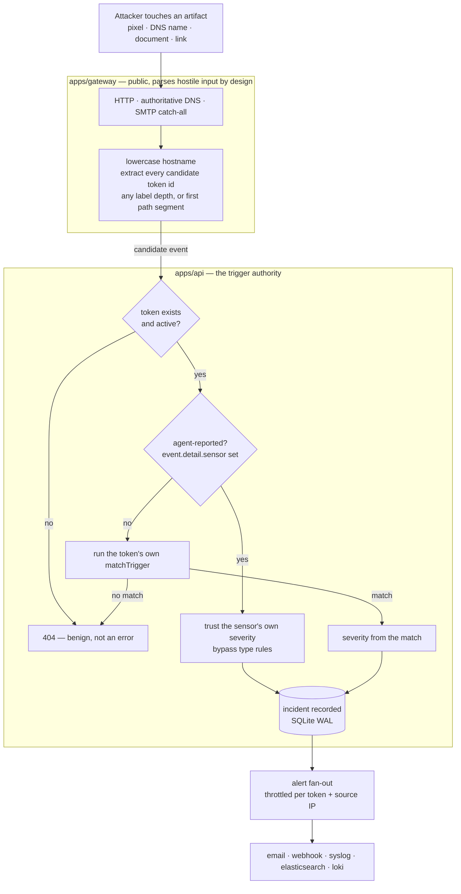
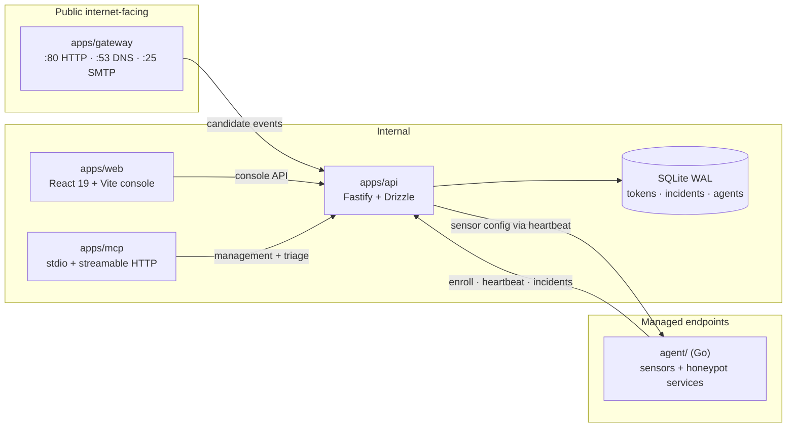
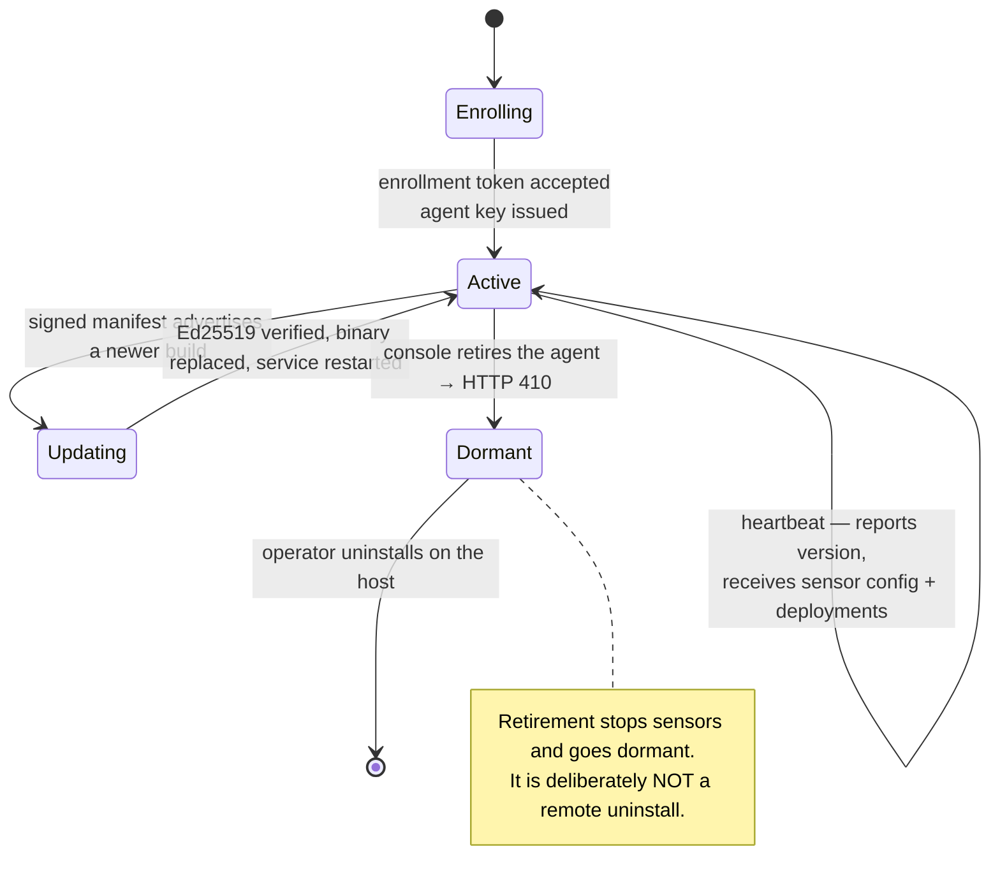

# f0_hpot Public Release Implementation Plan

> **For agentic workers:** REQUIRED SUB-SKILL: Use superpowers:subagent-driven-development (recommended) or superpowers:executing-plans to implement this plan task-by-task. Steps use checkbox (`- [ ]`) syntax for tracking.

**Goal:** Publish `ubercylon8/f0_hpot` as a credible open-source project — history free of operational identifiers, documentation that matches the shipped code, and a complete contribution surface.

**Architecture:** Three sequential phases. Phase A removes live infrastructure identifiers from the working tree *and* git history, then adds a CI gate so they cannot return. Phase B rewrites the documentation, which currently describes a much earlier project than the one that exists. Phase C adds community files, release metadata and the first version tag. Phase A must complete before Phase B, because the history rewrite changes every commit SHA and Phase B's hardening log cites 24 of them.

**Tech Stack:** Markdown, Mermaid (GitHub-native rendering), `git filter-repo`, GitHub Actions, Playwright (screenshots), pnpm/turbo monorepo, Go agent.

**Spec:** `docs/superpowers/specs/2026-09-03-public-release-design.md`

## Global Constraints

- **Public name is `f0_hpot`.** Repo URL `github.com/ubercylon8/f0_hpot` is unchanged. Package name and all docs align to `f0_hpot`.
- **Internal workspace scope `@f0/deception-*` is NOT renamed.** Those packages are `private: true` and never published.
- **No real operational identifiers in any tracked file, ever.** This includes this plan and the spec. Refer to identifiers by category ("the production VPS IP"), never by value. Derive actual values at runtime with `git grep`.
- **Placeholders to substitute:** IPv4 → `203.0.113.10` (RFC 5737 documentation range). Domains → `example.com`, `tokens.example.com`, `console.example.com`. Hostnames → `host-a`, `host-b`. Email → `security@example.com`.
- **Every GitHub Actions `uses:` is pinned by commit SHA** with a trailing `# vX.Y.Z` comment, and every checkout that does not push sets `persist-credentials: false`. The `zizmor` workflow is a blocking gate and will fail otherwise.
- **Workflow `permissions:` blocks are least-privilege.** A `permissions:` block replaces defaults entirely — a job needing `security-events: write` must also state `contents: read` or checkout 403s.
- **Node ≥22, pnpm 11.23.0, Go 1.26.5.**
- **`pnpm build` must run before `pnpm typecheck` or `pnpm test`** (turbo `dependsOn: ^build`).
- **Commit message trailers** on every commit:
  ```
  Co-Authored-By: Claude Opus 5 (1M context) <noreply@anthropic.com>
  Claude-Session: https://claude.ai/code/session_01Lu7VJWLy1AETmnLjdaGi6M
  ```
- **Apache-2.0 licence headers** on any new source file (`.ts`, `.go`, `.mjs`). Markdown files do not carry headers.

---

## Phase A — Sanitization

### Task 1: Move internal working docs out of the tracked tree

`docs/HANDOFF.md` and `docs/TEST-FINDINGS.md` are session working notes carrying the production VPS IP, the real token and console domains, two lab agent hostnames and the maintainer's email. Their durable content is republished in Phase B. They remain on disk — this task un-tracks them, it does not delete them.

**Files:**
- Modify: `.gitignore`
- Move (untracked): `docs/HANDOFF.md` → `docs/internal/HANDOFF.md`
- Move (untracked): `docs/TEST-FINDINGS.md` → `docs/internal/TEST-FINDINGS.md`
- Modify: `CLAUDE.md`, `AGENTS.md` (they link to the moved paths)

**Interfaces:**
- Produces: `docs/internal/` as the untracked location every later task reads source material from.

- [ ] **Step 1: Record the current identifier inventory before anything moves**

```bash
cd /home/jimx/F0RT1KA/f0_deception
mkdir -p /tmp/f0-release
git grep -InE '([0-9]{1,3}\.){3}[0-9]{1,3}' -- docs/ | grep -vE '127\.0\.0\.1|0\.0\.0\.0|203\.0\.113\.' > /tmp/f0-release/inventory-before.txt
git grep -In "$(git config user.email | cut -d@ -f2)" -- . >> /tmp/f0-release/inventory-before.txt 2>/dev/null || true
wc -l /tmp/f0-release/inventory-before.txt
```

Expected: a non-empty inventory. Keep this file; Task 4 asserts the same query returns zero.

- [ ] **Step 2: Move the files and stop tracking them**

```bash
mkdir -p docs/internal
git mv docs/HANDOFF.md docs/internal/HANDOFF.md
git mv docs/TEST-FINDINGS.md docs/internal/TEST-FINDINGS.md
git rm --cached docs/internal/HANDOFF.md docs/internal/TEST-FINDINGS.md
```

- [ ] **Step 3: Add the ignore rule with an explanation**

Append to `.gitignore`:

```gitignore
# Session working notes. These carry live deployment details (IPs, domains,
# lab hostnames) and are deliberately NOT version-controlled. They remain on
# disk for the maintainer; their durable content is published in
# ARCHITECTURE.md and docs/HARDENING-LOG.md.
docs/internal/
```

- [ ] **Step 4: Fix the two files that link to the old paths**

`CLAUDE.md` "Read first" references `docs/HANDOFF.md`, and `AGENTS.md` has a "Hand-off" section pointing at it. Both must now point at public docs. Replace the `docs/HANDOFF.md` reference in each with:

```markdown
- `ARCHITECTURE.md` — component boundaries, the trigger flow, and the reasoning behind the invariants.
```

- [ ] **Step 5: Verify the tree is clean and the files still exist on disk**

```bash
git status --short
ls -la docs/internal/
git ls-files docs/ | grep -c internal   # expected: 0
```

Expected: `docs/internal/` untracked and ignored, both files present on disk, `git ls-files` shows zero internal files.

- [ ] **Step 6: Commit**

```bash
git add -A
git commit -m "docs: move session working notes out of the tracked tree

HANDOFF.md and TEST-FINDINGS.md carry the production VPS IP, real token
and console domains, lab agent hostnames and an email address. They are
working notes, not project documentation. They stay on disk under
docs/internal/ (gitignored); their durable content is republished as
ARCHITECTURE.md and docs/HARDENING-LOG.md.

Co-Authored-By: Claude Opus 5 (1M context) <noreply@anthropic.com>
Claude-Session: https://claude.ai/code/session_01Lu7VJWLy1AETmnLjdaGi6M"
```

---

### Task 2: Remove the identifiers from git history

Publishing the repo publishes all commits, so Task 1 alone is insufficient. Exactly three paths ever contained the identifiers: the two moved in Task 1, and the release design spec (its sanitization section lists them by value). Removing those three paths from all history is both simpler and more thorough than text substitution, and it achieves the "working notes stay private" goal in the same operation.

**This task rewrites every commit SHA.** It must complete before Task 8, which cites 24 commit hashes.

**Files:**
- Rewrites: entire git history
- Produces: `.git/filter-repo/commit-map`
- Removes from history: `docs/internal/HANDOFF.md`, `docs/internal/TEST-FINDINGS.md`, `docs/HANDOFF.md`, `docs/TEST-FINDINGS.md`, `docs/superpowers/specs/2026-09-03-public-release-design.md`

**Interfaces:**
- Produces: `/tmp/f0-release/commit-map` — a two-column `old-sha new-sha` file consumed by Task 8.

- [ ] **Step 1: Install git-filter-repo**

It is not currently installed. On Arch:

```bash
sudo pacman -S --needed git-filter-repo
git filter-repo --version
```

If pacman is unavailable, `pipx install git-filter-repo` works equally well.

- [ ] **Step 2: Back up the repository before rewriting**

```bash
cd /home/jimx/F0RT1KA
tar czf /tmp/f0-release/f0_deception-backup-$(date +%s).tar.gz f0_deception
ls -lh /tmp/f0-release/*.tar.gz
```

Expected: a backup archive exists. Do not proceed without it.

- [ ] **Step 3: Verify on a mirror clone first — do not touch the real repo yet**

```bash
cd /tmp/f0-release
rm -rf mirror.git && git clone --mirror /home/jimx/F0RT1KA/f0_deception mirror.git
cd mirror.git
git filter-repo --force \
  --invert-paths \
  --path docs/HANDOFF.md \
  --path docs/TEST-FINDINGS.md \
  --path docs/internal/HANDOFF.md \
  --path docs/internal/TEST-FINDINGS.md \
  --path docs/superpowers/specs/2026-09-03-public-release-design.md
```

- [ ] **Step 4: Assert the mirror is clean**

```bash
cd /tmp/f0-release/mirror.git
IP=$(rg -oN '([0-9]{1,3}\.){3}[0-9]{1,3}' /tmp/f0-release/inventory-before.txt | grep -vE '127\.0\.0\.1|0\.0\.0\.0' | head -1)
for term in "$IP" "$(git config --get user.email | cut -d@ -f2)"; do
  n=$(git log --all -S"$term" --oneline | wc -l)
  echo "$term -> $n commits"
done
```

Expected: every term reports `0 commits`. If any is non-zero, a fourth path contains it — find it with `git log --all -S"$term" --name-only`, add it to the `--path` list, and redo from Step 3.

- [ ] **Step 5: Confirm history is otherwise intact**

```bash
cd /tmp/f0-release/mirror.git
git rev-list --count master     # expected: 135 or 136, not a drastically smaller number
git log --oneline | tail -1     # expected: the original scaffold commit, same subject
```

Expected: commit count essentially unchanged (only commits whose *entire* content was the removed files would vanish), and the first commit's subject line still reads `feat: monorepo scaffold, core API, gateway, first tokens (P0+P1)`.

- [ ] **Step 6: Run the same rewrite on the real repository**

```bash
cd /home/jimx/F0RT1KA/f0_deception
git filter-repo --force \
  --invert-paths \
  --path docs/HANDOFF.md \
  --path docs/TEST-FINDINGS.md \
  --path docs/internal/HANDOFF.md \
  --path docs/internal/TEST-FINDINGS.md \
  --path docs/superpowers/specs/2026-09-03-public-release-design.md
cp .git/filter-repo/commit-map /tmp/f0-release/commit-map
wc -l /tmp/f0-release/commit-map
```

Expected: `commit-map` has one line per original commit. Task 8 depends on this file — do not lose it.

- [ ] **Step 7: Confirm the working notes survived on disk**

`filter-repo` rewrites history, not your untracked files, but verify:

```bash
ls -la docs/internal/
```

Expected: both files still present. If they are gone, restore them from the Step 2 backup.

- [ ] **Step 8: Re-add the remote (filter-repo removes it by design)**

```bash
git remote add origin https://github.com/ubercylon8/f0_hpot.git
git remote -v
```

---

### Task 3: Republish the design spec and this plan, scrubbed

Task 2 removed the spec from history because its sanitization section listed identifiers by value. The spec is worth publishing — a project showing its own release-prep reasoning is a good signal — so it returns with that table genericized.

**Files:**
- Create: `docs/superpowers/specs/2026-09-03-public-release-design.md` (scrubbed)
- Create: `docs/superpowers/plans/2026-09-03-public-release.md` (this file, already identifier-free)

- [ ] **Step 1: Restore the spec from the backup and genericize its identifier table**

Extract the spec from the Step-2 backup of Task 2, then rewrite section 3.1's table so it names categories rather than values:

```markdown
| Identifier | Where |
|---|---|
| Production VPS IPv4 address | `docs/HANDOFF.md`, `docs/TEST-FINDINGS.md`, 2 commits |
| Operator's apex domain and its token/console subdomains | `docs/HANDOFF.md`, `docs/TEST-FINDINGS.md`, 3 commits |
| Two lab agent hostnames | `docs/TEST-FINDINGS.md` |
| Maintainer email address | `docs/HANDOFF.md` |
```

Also replace the two prose mentions of the real domain in section 3.2 with "the operator's own domain".

- [ ] **Step 2: Verify the restored spec is clean**

```bash
cd /home/jimx/F0RT1KA/f0_deception
rg -nE '([0-9]{1,3}\.){3}[0-9]{1,3}' docs/superpowers/ | rg -v '203\.0\.113\.|127\.0\.0\.1|5737'
```

Expected: no output.

- [ ] **Step 3: Commit both documents**

```bash
git add docs/superpowers/
git commit -m "docs: release design spec and implementation plan

The spec returns after the history rewrite with its identifier table
genericized — it previously listed the values it exists to remove.

Co-Authored-By: Claude Opus 5 (1M context) <noreply@anthropic.com>
Claude-Session: https://claude.ai/code/session_01Lu7VJWLy1AETmnLjdaGi6M"
```

---

### Task 4: Add a blocking CI gate for operational identifiers

The rule that caught this once must not be able to stop catching it. This follows the repo's existing gate philosophy (`zizmor`, `semgrep`, `gitleaks` are all blocking).

**Files:**
- Create: `.github/workflows/no-identifiers.yml`
- Create: `scripts/ci/check-identifiers.sh`

**Interfaces:**
- Produces: `scripts/ci/check-identifiers.sh` — exits 0 when clean, 1 with a file:line report when not. Runnable locally with no arguments.

- [ ] **Step 1: Write the check script**

Create `scripts/ci/check-identifiers.sh`:

```bash
#!/usr/bin/env bash
# Fail if a tracked file contains a real operational identifier.
#
# Deception infrastructure is only useful while an adversary does not know
# which domain and which console belong to the defender. Documentation drifts
# toward concrete examples over time; this gate keeps those examples fictional.
set -uo pipefail

fail=0
report() { echo "::error file=$1,line=$2::$3"; fail=1; }

# Public IPv4 literals, excluding loopback, any-address, link-local, RFC 1918
# private ranges, and the RFC 5737 documentation ranges.
while IFS=: read -r file line _; do
  [ -z "${file:-}" ] && continue
  report "$file" "$line" "public IPv4 literal — use 203.0.113.10 (RFC 5737)"
done < <(git grep -InE '\b([0-9]{1,3}\.){3}[0-9]{1,3}\b' -- . ':!pnpm-lock.yaml' ':!*.svg' \
  | grep -vE '\b(127\.0\.0\.1|0\.0\.0\.0|255\.255\.255\.255)\b' \
  | grep -vE '\b(10|192\.168)\.' \
  | grep -vE '\b172\.(1[6-9]|2[0-9]|3[01])\.' \
  | grep -vE '\b169\.254\.' \
  | grep -vE '\b(192\.0\.2|198\.51\.100|203\.0\.113)\.' \
  | grep -vE '\b[0-9]+\.[0-9]+\.[0-9]+\.[0-9]+\b.*(version|Version|VERSION)')

# Domains and hostnames that must never appear. Supplied through the
# environment, NEVER stored in the repository: a denylist naming the
# operator's real domain would publish the very string it exists to hide.
# CI injects it from a repository secret; locally, export it in your shell.
for pattern in ${F0_IDENTIFIER_DENYLIST:-}; do
  while IFS=: read -r file line _; do
    [ -z "${file:-}" ] && continue
    report "$file" "$line" "operational identifier matched — use example.com"
  done < <(git grep -In "$pattern" -- .)
done

if [ "$fail" -eq 0 ]; then echo "no operational identifiers found"; fi
exit "$fail"
```

Then `chmod +x scripts/ci/check-identifiers.sh`.

- [ ] **Step 2: Prove the gate fails on a deliberate violation (RED)**

```bash
cd /home/jimx/F0RT1KA/f0_deception
echo "Deploy to 198.18.7.7 for testing" > /tmp/f0-release/violation.md
cp /tmp/f0-release/violation.md docs/violation-test.md
git add docs/violation-test.md
./scripts/ci/check-identifiers.sh; echo "exit=$?"
```

Expected: `exit=1` and an `::error file=docs/violation-test.md` line naming the IP. If it exits 0 the gate is useless — fix the script before continuing.

- [ ] **Step 3: Remove the violation and prove the gate passes (GREEN)**

```bash
git rm -f docs/violation-test.md
./scripts/ci/check-identifiers.sh; echo "exit=$?"
```

Expected: `exit=0` and `no operational identifiers found`.

- [ ] **Step 4: Write the workflow**

Create `.github/workflows/no-identifiers.yml`. The operator's real domain is passed as an argument so the value lives in one place, not scattered through the repo:

```yaml
name: No operational identifiers

on:
  push:
    branches: [master]
  pull_request:

permissions:
  contents: read

jobs:
  identifiers:
    name: Docs carry no live infrastructure
    runs-on: ubuntu-latest
    steps:
      - uses: actions/checkout@3d3c42e5aac5ba805825da76410c181273ba90b1  # v7.0.1
        with:
          # zizmor[artipacked]: the checkout's credentials are not needed past this step.
          persist-credentials: false
          fetch-depth: 0

      - name: Check tracked files
        # Deception only works while the adversary does not know which domain
        # belongs to the defender. Blocking, like the other repo gates.
        env:
          # Space-separated regexes. Held as a secret rather than committed:
          # a denylist naming the real domain would publish the exact string
          # this gate exists to keep out of the repository.
          F0_IDENTIFIER_DENYLIST: ${{ secrets.IDENTIFIER_DENYLIST }}
        run: ./scripts/ci/check-identifiers.sh
```

The public-IPv4 check is structural and needs no configuration, so the gate
still does useful work for a forked contributor with no access to the secret.

- [ ] **Step 5: Create the denylist secret**

The values go here and nowhere else in the repository. Build the list from
what the sanitization actually removed — the operator's apex domain and the
two lab hostnames — as space-separated regexes:

```bash
read -rs -p "denylist regexes (space separated): " DENY && echo
gh secret set IDENTIFIER_DENYLIST --repo ubercylon8/f0_hpot --body "$DENY"
gh secret list --repo ubercylon8/f0_hpot | grep IDENTIFIER_DENYLIST
```

Export the same value locally so the script does the full check on your
machine too, and add it to your shell profile:

```bash
export F0_IDENTIFIER_DENYLIST='<same value>'
./scripts/ci/check-identifiers.sh; echo "exit=$?"
```

Expected: `exit=0` on a clean tree, and the secret listed on the repo.

- [ ] **Step 6: Validate the workflow against the zizmor gate**

```bash
uvx zizmor@1.14.2 .github/workflows/no-identifiers.yml
```

Expected: no findings. If `persist-credentials` or pinning is flagged, fix and re-run.

- [ ] **Step 7: Commit**

```bash
git add scripts/ci/check-identifiers.sh .github/workflows/no-identifiers.yml
git commit -m "ci: block operational identifiers in tracked files

Deception infrastructure only works while an adversary does not know which
domain and console belong to the defender. Documentation drifts toward
concrete examples over time, so this gate keeps them fictional: public IPv4
literals outside the RFC 5737 documentation ranges, plus a denylist injected
from a repository secret — committing that list would publish the exact
strings the gate exists to keep out.

Verified by feeding it a deliberate violation before wiring it up.

Co-Authored-By: Claude Opus 5 (1M context) <noreply@anthropic.com>
Claude-Session: https://claude.ai/code/session_01Lu7VJWLy1AETmnLjdaGi6M"
```

---

### Task 5: Force-push and re-point the VPS clone

**Files:** none (remote and deployment operation)

- [ ] **Step 1: Confirm with the maintainer before force-pushing**

This rewrites the published history of a repository that has a deployment clone. Do not proceed silently. State: the branch will be force-pushed, and the VPS clone at `/home/jimx/f0_hpot` will need a hard reset.

- [ ] **Step 2: Force-push**

```bash
cd /home/jimx/F0RT1KA/f0_deception
git push --force-with-lease origin master
```

`--force-with-lease` rather than `--force`: it refuses if the remote moved since the last fetch, which is the difference between rewriting your own history and discarding someone else's work.

- [ ] **Step 3: Reset the deployment clone**

```bash
ssh root@<vps> 'su - jimx -c "cd /home/jimx/f0_hpot && git fetch origin && git reset --hard origin/master && git log --oneline -1"'
```

Expected: the VPS reports the new HEAD SHA, matching local `git rev-parse --short HEAD`.

- [ ] **Step 4: Verify the deployment still builds from the reset clone**

```bash
ssh root@<vps> 'su - jimx -c "cd /home/jimx/f0_hpot && docker compose -f deploy/docker-compose.yml ps --format \"{{.Service}} {{.State}}\""'
```

Expected: `api running`, `console running`, `gateway running`. No rebuild is required — this phase changed no product code.

---

## Phase B — Documentation

### Task 6: ARCHITECTURE.md

The single most valuable public document, and the only place the reasoning behind the invariants survives once `HANDOFF.md` is untracked.

**Files:**
- Create: `ARCHITECTURE.md`
- Read for source material: `docs/internal/HANDOFF.md` (untracked, still on disk)

**Interfaces:**
- Produces: `ARCHITECTURE.md` anchors `#trigger-flow`, `#components`, `#agent-lifecycle` — referenced by README (Task 11) and CONTRIBUTING (Task 12).

- [ ] **Step 1: Write the trigger-flow diagram**

The diagram must make two things visible that a box-and-arrow sketch would hide: the gateway never decides whether an event is a real trigger, and a 404 from the API is a *normal* outcome rather than an error.

````markdown
## Trigger flow


````

Follow it with prose making explicit: the gateway forwards *candidates*, the token type's own `matchTrigger` is authoritative, and 404s are expected traffic — internet background noise hitting the catch-all.

- [ ] **Step 2: Write the component topology diagram**

````markdown
## Components


````

Prose: which ports face the internet, why the gateway is the only public component, and that sensor configuration is fleet-managed through the heartbeat rather than through environment variables on the endpoint.

- [ ] **Step 3: Write the agent lifecycle diagram**

````markdown
## Agent lifecycle


````

- [ ] **Step 4: Write the invariants section**

Port these from `docs/internal/HANDOFF.md` — each with its *reason*, which is what makes the section worth reading:

- Token ids are lowercase-only (`23456789abcdefghjkmnpqrstuvwxyz`) because DNS is case-insensitive and the gateway lowercases every hostname.
- Token ids may sit at any label depth under the base domain, or as the first URL path segment for apex-hosted artifacts.
- Artifacts are DB-backed (`token_files`, base64), never filesystem paths — the gateway performs no request-path→filesystem mapping.
- Agent-reported incidents bypass type rules (`event.detail.sensor` present) and carry their own severity.
- Sensor config is fleet-managed through `agent_sensors`, delivered by heartbeat.
- Agent retirement is dormancy, not remote uninstall: a compromised console must not be able to wipe a fleet or destroy evidence, and restored backups would otherwise produce false positives.
- Adding a token type is one file in `packages/tokens-core/src/` plus registration; its `matchTrigger` rules must mirror the artifact paths served by `apps/gateway/src/artifacts.ts`.

- [ ] **Step 5: Verify the Mermaid renders**

```bash
rg -c '```mermaid' ARCHITECTURE.md   # expected: 3
```

Then open the file on GitHub after pushing, or paste each block into <https://mermaid.live>, and confirm all three render without a parse error.

- [ ] **Step 6: Verify no identifiers leaked from the source document**

```bash
./scripts/ci/check-identifiers.sh
```

Expected: `exit=0`.

- [ ] **Step 7: Commit**

```bash
git add ARCHITECTURE.md
git commit -m "docs: add ARCHITECTURE.md with trigger flow and invariants

Ports the architecture rationale out of the untracked working notes so it
survives publication. Three Mermaid diagrams: the trigger flow (making
visible that the gateway forwards candidates and the API's matchTrigger
is authoritative, so a 404 is a normal outcome), component topology, and
the agent lifecycle including why retirement is dormancy rather than
remote uninstall.

Co-Authored-By: Claude Opus 5 (1M context) <noreply@anthropic.com>
Claude-Session: https://claude.ai/code/session_01Lu7VJWLy1AETmnLjdaGi6M"
```

---

### Task 7: docs/TOKEN-TYPES.md

The README claims 16 token types; nothing documents what they are. This is the reference a prospective user reads to decide whether the project does what they need.

**Files:**
- Create: `docs/TOKEN-TYPES.md`
- Read for accuracy: `packages/tokens-core/src/*.ts`, `packages/shared/src/token.ts`

- [ ] **Step 1: Confirm the authoritative list before writing a word**

```bash
cd /home/jimx/F0RT1KA/f0_deception
sed -n '/tokenTypeSchema/,/]/p' packages/shared/src/token.ts
```

Expected: exactly these 16, and the document must match them one-for-one — `web_bug`, `custom_image`, `dns`, `email`, `qr_code`, `word_doc`, `excel_doc`, `pdf_doc`, `windows_folder`, `sensitive_cmd`, `cloned_website`, `sql_injection`, `fast_redirect`, `aws_keys`, `azure_config`, `honeypot`.

- [ ] **Step 2: Write the summary table**

```markdown
| Type | Artifact you plant | What trips it | Group |
|---|---|---|---|
| `web_bug` | 1×1 pixel URL | any HTTP fetch of the pixel | Network |
| `custom_image` | operator-uploaded image URL | any HTTP fetch of the image | Network |
| `dns` | unique hostname | any DNS resolution of the name | Network |
| `email` | unique trigger address | inbound mail to the address (needs MX + inbound :25) | Network |
| `windows_folder` | folder containing `desktop.ini` | Explorer resolving the icon's UNC path → DNS | Network |
| `sensitive_cmd` | fake command-output page | HTTP fetch of the decoy page | Network |
| `fast_redirect` | link that 302s onward | the click — captured, then redirected | Network |
| `sql_injection` | decoy endpoint rules | a request matching the injection decoy | Network |
| `qr_code` | printable QR PNG | scanning it | Documents |
| `word_doc` | `.docx` with a remote image | opening it in Word | Documents |
| `excel_doc` | `.xlsx` with a hyperlink | opening / following the link | Documents |
| `pdf_doc` | PDF with an open-action | opening it in a reader that honours the action | Documents |
| `cloned_website` | beaconed clone of a real page | loading the clone | Documents |
| `aws_keys` | decoy AWS credentials | your CloudTrail wiring reporting their use | Cloud decoys |
| `azure_config` | decoy client id / secret | your Azure audit wiring reporting their use | Cloud decoys |
| `honeypot` | *nothing* — a reference token | an agent sensor reporting against it | Agent |
```

- [ ] **Step 3: Write the per-type sections**

One short section each: what `generate()` produces, what `matchTrigger` accepts, the severity it assigns, and where the type is worth planting. Read each definition rather than guessing — the files are `network-tokens.ts`, `document-tokens.ts`, `pdf-clone-tokens.ts`, `cloud-tokens.ts`.

Two need explicit caveats:

- **`aws_keys` / `azure_config` are inert without one-time cloud wiring.** They generate believable credentials *and* the instructions to route your own tenant's audit log to this platform's ingest URL. Without that step they are decorations. Say so plainly rather than letting a user discover it after planting them.
- **`honeypot` is the odd one out.** It plants nothing, `matchTrigger` returns `{ matched: false }` unconditionally so no internet-facing event can ever trip it, and it exists solely to give an agent sensor a revocable entity to report against. It is provisioned automatically when a sensor is saved without one — creating it by hand is only for sharing a single token across several sensors.

- [ ] **Step 4: Note the SSH double-incident behaviour**

`docs/internal/USER-GUIDE` source material records that one SSH session deliberately produces two incidents — a credential attempt and a command execution — because they are separate evidence. Carry that note across; it otherwise reads as a duplicate-alert bug.

- [ ] **Step 5: Verify every type is documented**

```bash
for t in web_bug custom_image dns email qr_code word_doc excel_doc pdf_doc \
         windows_folder sensitive_cmd cloned_website sql_injection \
         fast_redirect aws_keys azure_config honeypot; do
  rg -q "\`$t\`" docs/TOKEN-TYPES.md || echo "MISSING: $t"
done
echo "check complete"
```

Expected: no `MISSING` lines.

- [ ] **Step 6: Commit**

```bash
git add docs/TOKEN-TYPES.md
git commit -m "docs: document all 16 token types

Artifact, trigger condition, severity and where to plant each. Flags the
two that are inert without one-time cloud wiring, and the honeypot type
that plants nothing and can never be tripped from the internet.

Co-Authored-By: Claude Opus 5 (1M context) <noreply@anthropic.com>
Claude-Session: https://claude.ai/code/session_01Lu7VJWLy1AETmnLjdaGi6M"
```

---

### Task 8: docs/AGENT-GUIDE.md and docs/ALERTING.md

**Files:**
- Create: `docs/AGENT-GUIDE.md`
- Create: `docs/ALERTING.md`

- [ ] **Step 1: Confirm the sensor and channel enums**

```bash
sed -n '/sensorKindSchema/,/]/p' packages/shared/src/agent.ts
sed -n '/alertChannelKindSchema/,/]/p' packages/shared/src/agent.ts
```

Expected sensors: `ssh`, `http_login`, `smb`, `rdp`, `planted_credential`, `file_watch`.
Expected channels: `email`, `webhook`, `syslog`, `elasticsearch`, `loki`.

- [ ] **Step 2: Write AGENT-GUIDE.md**

Cover, in order: enrollment (managed enrollment tokens, the per-platform one-liner from the console, what the agent installs — a systemd unit on Linux, a real SCM service on Windows); the six sensor kinds with their config fields; that sensor configuration arrives through the heartbeat and a config change restarts that sensor generation; signed self-update (Ed25519 manifest, verified before replacement); and retirement semantics.

Three honest limitations belong here, not buried:

- **NTFS last-access updates are disabled by default on modern Windows.** `fsutil behavior query DisableLastAccess` typically reports `2 (System Managed, Disabled)`. Bait *reads* therefore cannot be detected on such hosts; the sensor probes this at startup and reports the limitation rather than pretending to watch.
- **Retiring an agent from the console does not uninstall it.** It stops sensors and goes dormant. Uninstalling is a deliberate action on the host.
- **A sensor needs a reporting token.** One saved without a token id is provisioned one automatically; the field is only for sharing a token across sensors.

- [ ] **Step 3: Write ALERTING.md**

The five channel kinds and their config shapes, the alert payload schema, per-`(token, source IP)` throttling controlled by `F0_MAX_ALERTS_PER_MINUTE`, and the blank-means-keep rule for editing channel secrets (an empty secret field preserves the stored value; it does not clear it).

State plainly which integrations are verified end-to-end and which are wire-format-tested only. As of this plan: webhook and syslog are verified live; `email` requires an SMTP relay you supply; `elasticsearch` and `loki` have asserted wire formats but have not been run against real instances; **Slack and Teams webhooks will reject the payload as shipped**, because it is the raw alert object rather than Block Kit / MessageCard. Do not let that surface as a surprise.

- [ ] **Step 4: Verify enum coverage**

```bash
for s in ssh http_login smb rdp planted_credential file_watch; do
  rg -q "\`$s\`" docs/AGENT-GUIDE.md || echo "MISSING sensor: $s"
done
for c in email webhook syslog elasticsearch loki; do
  rg -q "\`$c\`" docs/ALERTING.md || echo "MISSING channel: $c"
done
echo "check complete"
```

Expected: no `MISSING` lines.

- [ ] **Step 5: Commit**

```bash
git add docs/AGENT-GUIDE.md docs/ALERTING.md
git commit -m "docs: add agent and alerting guides

Agent guide covers enrollment, the six sensor kinds, heartbeat-delivered
config, signed self-update and service lifecycle — including three limits
stated up front rather than discovered: NTFS last-access is off by default
so bait reads are undetectable on most Windows hosts, retirement is not
uninstall, and a sensor without a token id gets one provisioned.

Alerting guide documents the five channel kinds, throttling and the
blank-means-keep secret rule, and is explicit that Slack and Teams
webhooks reject the payload as shipped.

Co-Authored-By: Claude Opus 5 (1M context) <noreply@anthropic.com>
Claude-Session: https://claude.ai/code/session_01Lu7VJWLy1AETmnLjdaGi6M"
```

---

### Task 9: docs/HARDENING-LOG.md

A 46-finding self-audit, each with the commit that fixed it, is a trust signal very few projects can show. **Depends on Task 2's commit map** — every SHA in the source document predates the history rewrite.

**Files:**
- Create: `docs/HARDENING-LOG.md`
- Read: `docs/internal/TEST-FINDINGS.md` (untracked source)
- Read: `/tmp/f0-release/commit-map`

- [ ] **Step 1: Build the old→new SHA translation table**

```bash
cd /home/jimx/F0RT1KA/f0_deception
rg -o '`[0-9a-f]{7}`' docs/internal/TEST-FINDINGS.md | tr -d '`' | sort -u > /tmp/f0-release/old-shas.txt
wc -l /tmp/f0-release/old-shas.txt   # expected: 24
: > /tmp/f0-release/sha-map.txt
while read -r short; do
  full=$(grep -iE "^${short}" /tmp/f0-release/commit-map | head -1 | awk '{print $2}')
  if [ -n "$full" ] && [ "$full" != "0000000000000000000000000000000000000000" ]; then
    echo "$short ${full:0:7}" >> /tmp/f0-release/sha-map.txt
  else
    echo "UNMAPPED $short" >> /tmp/f0-release/sha-map.txt
  fi
done < /tmp/f0-release/old-shas.txt
cat /tmp/f0-release/sha-map.txt
```

Expected: 24 mapped pairs. Any `UNMAPPED` line means that commit was dropped entirely by the rewrite (its whole content was a removed file) — for those, cite the finding without a hash rather than citing a wrong one.

- [ ] **Step 2: Copy the source and apply the mapping**

```bash
cp docs/internal/TEST-FINDINGS.md docs/HARDENING-LOG.md
while read -r old new; do
  [ "$old" = "UNMAPPED" ] && continue
  sed -i "s/\`${old}\`/\`${new}\`/g" docs/HARDENING-LOG.md
done < /tmp/f0-release/sha-map.txt
```

- [ ] **Step 3: Scrub the identifiers and reframe for a public reader**

The source is a session document. Rewrite:

- Replace the production IP, real domains and lab hostnames with `203.0.113.10`, `example.com` / `tokens.example.com` / `console.example.com`, `host-a` / `host-b`.
- Retitle from "systematic test findings" to a hardening log, with an opening paragraph explaining what it is: a self-audit of the running deployment, kept in full rather than pruned once fixed, so the reasoning behind each change stays readable.
- **Delete section 5 entirely** ("Pending work — pick up here", including the live-environment inventory). It is a continuation note for the maintainer, has no public meaning, and 5d is precisely the leak.
- Convert remaining second-person session voice ("your VPS", "you should") to neutral description.

- [ ] **Step 4: Verify every SHA now resolves**

```bash
fail=0
for sha in $(rg -o '`[0-9a-f]{7}`' docs/HARDENING-LOG.md | tr -d '`' | sort -u); do
  git cat-file -e "${sha}^{commit}" 2>/dev/null || { echo "DANGLING: $sha"; fail=1; }
done
[ $fail -eq 0 ] && echo "all referenced commits resolve"
```

Expected: `all referenced commits resolve`. A dangling SHA means the log cites a commit that no longer exists — the exact failure the Phase A ordering was designed to prevent.

- [ ] **Step 5: Verify the scrub**

```bash
./scripts/ci/check-identifiers.sh
rg -c 'Pending work|pick up here' docs/HARDENING-LOG.md || echo "section 5 removed"
```

Expected: `exit=0` from the gate, and `section 5 removed`.

- [ ] **Step 6: Commit**

```bash
git add docs/HARDENING-LOG.md
git commit -m "docs: publish the hardening log

46 findings from a systematic audit of the running deployment, each with
the commit that fixed it. Kept in full rather than pruned once fixed so
the reasoning stays readable.

Commit references were remapped through filter-repo's commit-map, since
the history rewrite changed every SHA the source document cited. The
maintainer-facing 'pending work' section, which inventoried the live
environment, is removed rather than scrubbed.

Co-Authored-By: Claude Opus 5 (1M context) <noreply@anthropic.com>
Claude-Session: https://claude.ai/code/session_01Lu7VJWLy1AETmnLjdaGi6M"
```

---

### Task 10: Console screenshots from a local demo stack

A security console with no screenshot converts far fewer readers. Capture from a **local demo stack only** — production screenshots would reintroduce exactly the identifiers Phase A removed.

**Files:**
- Create: `scripts/dev/screenshots.mjs`
- Create: `docs/img/console-dashboard.png`, `docs/img/console-incidents.png`, `docs/img/console-tokens.png`, `docs/img/console-agents.png`

- [ ] **Step 1: Start the demo stack**

Four terminals, or one with background jobs. Values come from `deploy/local-demo.env`:

```bash
cd apps/api && F0_DB_PATH=/tmp/f0demo.db F0_API_PORT=18443 \
  F0_ENROLLMENT_TOKEN=bootstrap-test-123 F0_INTERNAL_SECRET=local-demo-secret \
  F0_ADMIN_TOKEN=demo-admin F0_GATEWAY_ORIGIN=http://localhost:18080 npx tsx src/server.ts

cd apps/gateway && F0_API_BASE_URL=http://127.0.0.1:18443 F0_HTTP_PORT=18080 \
  F0_DNS_PORT=15353 F0_TOKEN_DOMAINS=localhost,tokens.example.com \
  F0_INTERNAL_SECRET=local-demo-secret F0_GATEWAY_ORIGIN=http://localhost:18080 npx tsx src/server.ts

cd apps/web && npm run dev
```

- [ ] **Step 2: Seed demo data**

```bash
F0_E2E_ADMIN=demo-admin node scripts/e2e/seed.mjs
```

Expected: prints a console API key. Then create a few tokens and fire them so the incident view is not empty — an empty dashboard is a worse advertisement than no screenshot:

```bash
KEY=<printed key>
for t in web_bug dns word_doc aws_keys; do
  curl -s -X POST localhost:18443/api/v1/tokens -H "authorization: Bearer $KEY" \
    -H 'content-type: application/json' -d "{\"type\":\"$t\",\"memo\":\"demo $t\"}" | head -c 120; echo
done
# trigger one so incidents render
ID=$(curl -s -H "authorization: Bearer $KEY" localhost:18443/api/v1/tokens | python3 -c 'import json,sys;print(json.load(sys.stdin)[0]["id"])')
curl -s "http://localhost:18080/$ID/pixel.gif" -o /dev/null -w '%{http_code}\n'
```

- [ ] **Step 3: Write the capture script**

Create `scripts/dev/screenshots.mjs` with an Apache-2.0 header, using the Playwright dependency already in `devDependencies`:

```javascript
/*
 * Copyright 2026 The f0_hpot Authors
 * SPDX-License-Identifier: Apache-2.0
 *
 * Capture console screenshots for the README and docs.
 *
 * Deliberately points at a LOCAL demo stack: screenshots of a production
 * console would republish the token domain and console hostname that the
 * repository history was rewritten to remove.
 */
import { chromium } from "playwright";
import { mkdirSync } from "node:fs";

const BASE = process.env.F0_CONSOLE ?? "http://localhost:5173";
const KEY = process.env.F0_E2E_KEY;
if (!KEY) {
  console.error("F0_E2E_KEY is required (printed by scripts/e2e/seed.mjs)");
  process.exit(2);
}

const PAGES = [
  ["", "console-dashboard.png"],
  ["/incidents", "console-incidents.png"],
  ["/tokens", "console-tokens.png"],
  ["/agents", "console-agents.png"],
];

mkdirSync("docs/img", { recursive: true });
const browser = await chromium.launch();
const ctx = await browser.newContext({
  viewport: { width: 1440, height: 900 },
  deviceScaleFactor: 2,
});
await ctx.addInitScript((k) => localStorage.setItem("f0_api_key", k), KEY);
const page = await ctx.newPage();

for (const [path, file] of PAGES) {
  await page.goto(`${BASE}${path}`, { waitUntil: "networkidle" });
  await page.waitForTimeout(600);
  await page.screenshot({ path: `docs/img/${file}` });
  console.log(`wrote docs/img/${file}`);
}

await browser.close();
```

Confirm the localStorage key name against `apps/web/src/lib/` before running — if the console stores its key under a different name, this script silently captures a logged-out console.

- [ ] **Step 4: Capture**

```bash
F0_E2E_KEY=<key> node scripts/dev/screenshots.mjs
ls -lh docs/img/
```

Expected: four PNGs, each well over 50 KB. A tiny file means an empty or unauthenticated page.

- [ ] **Step 5: Inspect every screenshot before committing**

Open all four. Confirm: no real domain in any URL bar or table cell, no real hostname in the agents view, no personal data. This is a manual gate — the identifier script cannot read PNGs.

- [ ] **Step 6: Commit**

```bash
git add scripts/dev/screenshots.mjs docs/img/
git commit -m "docs: add console screenshots and their capture script

Captured from a local demo stack, never production: screenshots of the
real console would republish the token domain and console hostname the
history rewrite removed. The script is committed so they can be
regenerated when the UI changes.

Co-Authored-By: Claude Opus 5 (1M context) <noreply@anthropic.com>
Claude-Session: https://claude.ai/code/session_01Lu7VJWLy1AETmnLjdaGi6M"
```

---

### Task 11: Rewrite README.md

The highest-impact change in the plan. The current README states that `apps/web`, `apps/mcp` and `agent/` are *planned* and that the project is *"early development (Phase 1)"* where only web bug, DNS and fast-redirect tokens work. All three components ship and all 16 token types work. A reader currently concludes the project is a stub.

**Files:**
- Modify: `README.md` (full rewrite, 51 lines → roughly 120)

- [ ] **Step 1: Write the header and badges**

```markdown
# f0_hpot

**Self-hosted deception platform.** Plant canarytokens that phone home when
touched, and run full-interaction honeypots on your endpoints — without
sending a single detection to someone else's cloud.

[](https://github.com/ubercylon8/f0_hpot/actions/workflows/ci.yml)
[](LICENSE)


```

- [ ] **Step 2: Write an accurate status paragraph**

Replace the "Phase 1" block. It must be true of the shipped code and honest about maturity:

```markdown
> **Status:** pre-1.0 and self-hosted. All 16 token types, the management
> console, the endpoint agent fleet and MCP-based triage are working and in
> production use. Interfaces may still change between minor versions.
```

- [ ] **Step 3: Write the "what it is" and comparison sections**

Two comparisons a reader actually wants: against commercial canary appliances (you keep your detections, you run the infrastructure, no per-token cost, no vendor sees your estate) and against free public canarytoken services (your own domain, no shared infrastructure, endpoint honeypots, SIEM forwarding). Be fair — a hosted service needs no VPS, no DNS delegation and no upkeep, and that is a real advantage. A comparison that claims no trade-offs reads as marketing.

- [ ] **Step 4: Write the quickstart**

The local demo path from Task 10 Step 1–2, ending in a triggered token and a visible incident. Target: a reader reaches a real detection in under five minutes without reading another document.

Follow it with a short production section pointing at `docs/INSTALL.md`, stating the requirements plainly: a public VPS with ports 80/443/53/25, a domain you control, and NS delegation of a token subdomain to the host.

- [ ] **Step 5: Write the component table, docs index and responsible-use line**

Component table with the *true* state of each of `apps/gateway`, `apps/api`, `apps/web`, `apps/mcp`, `agent/`, `packages/tokens-core`, `packages/shared`. Docs index linking `ARCHITECTURE.md`, `docs/INSTALL.md`, `docs/USER-GUIDE.md`, `docs/TOKEN-TYPES.md`, `docs/AGENT-GUIDE.md`, `docs/ALERTING.md`, `docs/HARDENING-LOG.md`, `CONTRIBUTING.md`, `SECURITY.md`. Then one line, not a lecture:

```markdown
## Responsible use

This software runs honeypots that capture credentials supplied by whoever
touches them. Deploy it only on infrastructure you control, and read
[SECURITY.md](SECURITY.md) before you do.
```

- [ ] **Step 6: Verify every claim against the code**

Go through the README line by line. For each factual claim, name the file that proves it. Specifically confirm: the token-type count matches `tokenTypeSchema`; no component is described as "planned"; every documentation link resolves to a file that exists.

```bash
rg -n 'planned|Phase 1|early development' README.md || echo "no stale status claims"
for f in $(rg -o '\]\(([a-zA-Z0-9_/.-]+\.md)\)' -r '$1' README.md); do
  [ -f "$f" ] || echo "BROKEN LINK: $f"
done
[ -f docs/img/console-dashboard.png ] || echo "BROKEN IMAGE"
echo "link check complete"
```

Expected: `no stale status claims`, no `BROKEN` lines.

- [ ] **Step 7: Commit**

```bash
git add README.md
git commit -m "docs: rewrite README to describe the software that exists

The previous README described apps/web, apps/mcp and agent/ as planned and
the project as early-development with three working token types. All three
components ship and all 16 types work. Anyone landing on it concluded the
project was a stub.

Adds a console screenshot, an accurate pre-1.0 status statement, honest
comparisons against hosted canary services (including where they win), a
five-minute local quickstart ending in a real detection, and a
responsible-use pointer.

Co-Authored-By: Claude Opus 5 (1M context) <noreply@anthropic.com>
Claude-Session: https://claude.ai/code/session_01Lu7VJWLy1AETmnLjdaGi6M"
```

---

### Task 12: Refresh INSTALL.md and USER-GUIDE.md

Both predate several fixes and describe flows that have changed.

**Files:**
- Modify: `docs/INSTALL.md`
- Modify: `docs/USER-GUIDE.md`

- [ ] **Step 1: Scrub and correct INSTALL.md**

Replace every real domain with `example.com` / `tokens.example.com`. Verify each documented step against `deploy/install.mjs` — in particular that the Docker daemon-access preflight, the ACME TLS behaviour and the port-80 ownership (the gateway owns `:80`; the console is on `:443`) are described as they now behave. Add the mail-server coexistence note: a host already running a mail stack contends for port 25, and the token domain must be delegated by NS record rather than served from the existing DNS.

- [ ] **Step 2: Correct USER-GUIDE.md**

Its honeypot-link section is already current. Verify the rest against the console as it now behaves: channel editing exists, blank secret fields preserve stored values, agent retirement is dormancy, and sensors provision their own tokens. Remove anything describing a flow that no longer exists.

- [ ] **Step 3: Verify**

```bash
./scripts/ci/check-identifiers.sh
npx --yes lychee --no-progress docs/INSTALL.md docs/USER-GUIDE.md || true
```

Expected: gate `exit=0`; review any link failures lychee reports.

- [ ] **Step 4: Commit**

```bash
git add docs/INSTALL.md docs/USER-GUIDE.md
git commit -m "docs: refresh install and user guides

Scrubs real domains, and corrects both against current behaviour: the
gateway owns port 80 with the console on 443, the installer's Docker
preflight, mail-server port-25 contention, channel editing, and sensors
provisioning their own tokens.

Co-Authored-By: Claude Opus 5 (1M context) <noreply@anthropic.com>
Claude-Session: https://claude.ai/code/session_01Lu7VJWLy1AETmnLjdaGi6M"
```

---

## Phase C — Community and release

### Task 13: CONTRIBUTING.md, CODE_OF_CONDUCT.md, SECURITY.md

**Files:**
- Create: `CONTRIBUTING.md`
- Create: `CODE_OF_CONDUCT.md`
- Create: `SECURITY.md`

- [ ] **Step 1: Write CONTRIBUTING.md**

Cover: prerequisites (Node ≥22, pnpm 11.23.0, Go 1.26.5); that `pnpm install && pnpm build` must precede typecheck and test because turbo tasks declare `dependsOn: ["^build"]`; and the full gate list a PR must pass:

```bash
pnpm typecheck
pnpm test
cd agent && go test ./... && go vet ./... && gofmt -l .
semgrep scan --config .semgrep.yml
./scripts/ci/check-identifiers.sh
```

Note for the identifier gate: its public-IPv4 check always runs, and
maintainers additionally export `F0_IDENTIFIER_DENYLIST` (injected from a
repository secret in CI). A fork without the secret still gets the structural
check, which is the part that catches most mistakes.

Add the two workflow gotchas that cost real time in this repo, since a contributor will otherwise hit both:

- **After editing TypeScript, restart `tsx` processes.** `tsx` compiles at startup, so edits to a running dev server silently do not take effect.
- **`pnpm e2e` needs seeding first.** Run `F0_E2E_ADMIN=<admin token> node scripts/e2e/seed.mjs` against a fresh stack, or the suites fail in ways that read as product bugs.

Then a "How to add a token type" section — one file in `packages/tokens-core/src/`, registered in `registry.ts`, with `matchTrigger` rules mirroring the artifact paths served by `apps/gateway/src/artifacts.ts` — and a link to the invariants in `AGENTS.md` rather than a copy of them, so there is one authority.

- [ ] **Step 2: Add CODE_OF_CONDUCT.md**

Contributor Covenant 2.1, unmodified, from <https://www.contributor-covenant.org/version/2/1/code_of_conduct/>. Fill the enforcement contact with the GitHub security advisory link rather than a personal email address.

- [ ] **Step 3: Write SECURITY.md**

Two sections.

*Reporting a vulnerability* — GitHub private vulnerability reporting via the repository's Security tab (enabled in Task 15). No email address is published. State a response expectation you can actually meet, and that reporters are credited unless they ask otherwise.

*Responsible use* — short, factual, no lecture:

```markdown
## Responsible use

f0_hpot runs services designed to be attacked. They capture credentials,
NTLM challenge/response material and command input from whoever interacts
with them.

- Deploy only on infrastructure you own or are explicitly authorised to test.
- Captured credentials are supplied by the attacker and may belong to third
  parties. Treat incident data as sensitive; it is stored unencrypted in
  SQLite by default.
- Honeypot services deliberately present as vulnerable. Do not place them on
  a host you also use for anything else.
- Intercepting credentials has different legal footing in different
  jurisdictions. That is your call to make, not this project's.
```

- [ ] **Step 4: Verify the gate list is accurate by running it**

Every command in CONTRIBUTING must actually work. Run each one and confirm it exits 0 on a clean tree.

```bash
pnpm build && pnpm typecheck && pnpm test
cd agent && go test ./... && go vet ./... && gofmt -l . && cd ..
semgrep scan --config .semgrep.yml
```

Expected: all pass. A CONTRIBUTING file whose commands do not run is worse than none.

- [ ] **Step 5: Commit**

```bash
git add CONTRIBUTING.md CODE_OF_CONDUCT.md SECURITY.md
git commit -m "docs: add contributing, code of conduct and security policy

CONTRIBUTING documents the real gate list (verified by running it), the
build-before-typecheck ordering turbo requires, and the two gotchas that
cost the most time here: tsx compiles at startup so edits need a restart,
and the e2e suites need seeding or they fail like product bugs.

SECURITY routes reports through GitHub private vulnerability reporting
rather than a published inbox, and states the responsible-use scope a tool
that captures credentials needs.

Co-Authored-By: Claude Opus 5 (1M context) <noreply@anthropic.com>
Claude-Session: https://claude.ai/code/session_01Lu7VJWLy1AETmnLjdaGi6M"
```

---

### Task 14: Issue templates, PR template, CHANGELOG

**Files:**
- Create: `.github/ISSUE_TEMPLATE/bug_report.yml`
- Create: `.github/ISSUE_TEMPLATE/feature_request.yml`
- Create: `.github/ISSUE_TEMPLATE/config.yml`
- Create: `.github/PULL_REQUEST_TEMPLATE.md`
- Create: `CHANGELOG.md`

- [ ] **Step 1: Write bug_report.yml**

A GitHub issue form with required fields: component (dropdown — gateway, api, console, agent, mcp, tokens-core, deploy/installer), version or commit, deployment mode (local demo / Docker Compose / other), what happened, what was expected, reproduction steps, and relevant logs. Include a checkbox confirming the reporter has removed real domains and IPs from their logs — this project's own users will paste exactly the identifiers Phase A removed.

- [ ] **Step 2: Write feature_request.yml and config.yml**

`feature_request.yml`: problem being solved, proposed solution, alternatives considered. `config.yml` sets `blank_issues_enabled: false` and adds a contact link routing security reports to the advisory page instead of a public issue:

```yaml
blank_issues_enabled: false
contact_links:
  - name: Report a security vulnerability
    url: https://github.com/ubercylon8/f0_hpot/security/advisories/new
    about: Please report vulnerabilities privately, not as a public issue.
```

- [ ] **Step 3: Write PULL_REQUEST_TEMPLATE.md**

Short. What changed and why; how it was verified (with the gate commands); and a checklist covering the invariants a reviewer must not have to re-derive: token ids stay lowercase-only, no exec or request-path→filesystem mapping in the gateway, size caps on new input paths, `noUncheckedIndexedAccess` handled explicitly, Apache-2.0 header on new source files, and no real domains or IPs added.

- [ ] **Step 4: Write CHANGELOG.md**

Keep a Changelog format. A single `[0.1.0]` entry describing the first public release rather than a fabricated per-commit history — the repository has never been tagged, so there is no prior release to describe. Summarise honestly: 16 token types, gateway with HTTP/DNS/SMTP catch-all, console, Go agent fleet with six sensor kinds and signed self-update, five alert channel kinds, MCP triage, and a link to `docs/HARDENING-LOG.md` for the audit that preceded release.

- [ ] **Step 5: Validate the issue form YAML**

```bash
python3 -c "import yaml,sys
for f in ['.github/ISSUE_TEMPLATE/bug_report.yml','.github/ISSUE_TEMPLATE/feature_request.yml','.github/ISSUE_TEMPLATE/config.yml']:
    yaml.safe_load(open(f)); print('ok', f)"
```

Expected: `ok` for all three. GitHub silently ignores a malformed issue form, so this check matters.

- [ ] **Step 6: Commit**

```bash
git add .github/ISSUE_TEMPLATE .github/PULL_REQUEST_TEMPLATE.md CHANGELOG.md
git commit -m "docs: add issue and PR templates, and a changelog

The bug form asks reporters to scrub domains and IPs from pasted logs —
this project's users run exactly the kind of infrastructure whose
identifiers should not land in a public issue. Security reports route to
a private advisory rather than a public issue.

The PR template checklists the invariants so a reviewer does not have to
re-derive them.

Co-Authored-By: Claude Opus 5 (1M context) <noreply@anthropic.com>
Claude-Session: https://claude.ai/code/session_01Lu7VJWLy1AETmnLjdaGi6M"
```

---

### Task 15: Repository metadata, private reporting, and the v0.1.0 tag

**Files:**
- Modify: `package.json` (add `repository`, `description`, `keywords`)
- Remote configuration and tag

- [ ] **Step 1: Add repository metadata to package.json**

```json
"description": "Self-hosted deception platform — canarytokens and endpoint honeypots you run yourself",
"repository": { "type": "git", "url": "git+https://github.com/ubercylon8/f0_hpot.git" },
"homepage": "https://github.com/ubercylon8/f0_hpot#readme",
"bugs": { "url": "https://github.com/ubercylon8/f0_hpot/issues" },
"keywords": ["honeypot", "canarytokens", "deception", "blue-team", "threat-detection", "self-hosted"],
```

Keep `"private": true` — the root package is a workspace root, not a published npm package.

- [ ] **Step 2: Set the repository description and topics**

```bash
gh repo edit ubercylon8/f0_hpot \
  --description "Self-hosted deception platform — canarytokens and endpoint honeypots you run yourself" \
  --add-topic honeypot --add-topic canarytokens --add-topic deception \
  --add-topic blue-team --add-topic threat-detection --add-topic self-hosted \
  --add-topic security --add-topic golang --add-topic typescript
```

- [ ] **Step 3: Enable private vulnerability reporting**

```bash
gh api -X PATCH repos/ubercylon8/f0_hpot \
  -f security_and_analysis[secret_scanning_push_protection][status]=enabled
gh api -X PUT repos/ubercylon8/f0_hpot/private-vulnerability-reporting
```

Expected: both succeed. Verify in the repository's Settings → Security tab that private reporting is on — `SECURITY.md` points at it and would otherwise send reporters to a dead end.

- [ ] **Step 4: Verify the whole gate set passes before tagging**

```bash
cd /home/jimx/F0RT1KA/f0_deception
pnpm build && pnpm typecheck && pnpm test
cd agent && go test ./... && go vet ./... && gofmt -l . && cd ..
semgrep scan --config .semgrep.yml
./scripts/ci/check-identifiers.sh
git status --short
```

Expected: everything passes, working tree clean.

- [ ] **Step 5: Tag v0.1.0**

`release.yml` already cross-compiles five platforms and signs an Ed25519 manifest, but nothing has ever been tagged — agents currently report a commit SHA as their version. Tagging aligns the agent version, the release artifacts and the changelog.

```bash
git tag -a v0.1.0 -m "v0.1.0 — first public release"
git push origin master
git push origin v0.1.0
gh run watch
```

Expected: the Release workflow builds, signs and publishes five binaries plus a signed manifest.

- [ ] **Step 6: Flip the repository to public**

Only after every preceding step is green. This is irreversible in practice — the history becomes world-readable the moment it happens.

```bash
gh repo edit ubercylon8/f0_hpot --visibility public --accept-visibility-change-consequences
```

- [ ] **Step 7: Verify the published result**

```bash
gh repo view ubercylon8/f0_hpot --json visibility,description,repositoryTopics,licenseInfo
gh api repos/ubercylon8/f0_hpot/community/profile --jq '.health_percentage, .files | keys'
```

Expected: `visibility: PUBLIC`, description and topics set, Apache-2.0 detected, and the community profile reporting README, CODE_OF_CONDUCT, CONTRIBUTING, LICENSE, ISSUE_TEMPLATE and PULL_REQUEST_TEMPLATE all present.

---

## Self-review

Run before declaring the plan finished.

**Spec coverage** — every section of `docs/superpowers/specs/2026-09-03-public-release-design.md` maps to a task:

| Spec section | Task |
|---|---|
| §3.1 identifier removal (working tree) | 1 |
| §3.3 history rewrite, mirror verification, commit-map | 2 |
| §3.3 spec republication | 3 |
| §3.4 regression gate | 4 |
| §3.3 force-push and VPS reset | 5 |
| §4.2 ARCHITECTURE.md, three diagrams, invariants | 6 |
| §4.3 TOKEN-TYPES.md | 7 |
| §4.4 AGENT-GUIDE.md, §4.5 ALERTING.md | 8 |
| §4 HARDENING-LOG.md with remapped SHAs | 9 |
| §2 screenshots from a local stack | 10 |
| §4.1 README rewrite | 11 |
| §4 INSTALL/USER-GUIDE refresh | 12 |
| §5 SECURITY, CoC, CONTRIBUTING, responsible use | 13 |
| §5 templates and CHANGELOG | 14 |
| §5 metadata, private reporting, v0.1.0 tag | 15 |

**Success criteria coverage** — §8 criterion 1 is verified in Task 2 Step 4 and Task 15 Step 4; criterion 2 in Task 4 Steps 2–3 (deliberate violation, then clean); criterion 3 in Task 11 Step 4; criterion 4 in Task 11 Step 6; criterion 5 in Task 15 Step 7.

**Ordering constraints** — Task 2 must precede Task 9 (commit-map). Task 10 must precede Task 11 (the README embeds a screenshot). Task 4 must precede Tasks 6–12 (they all invoke the gate script). Task 15 Step 6 must be last.

**Known non-goals**, restated so they are not accidentally added: no product code changes, no docs site, no `@f0/deception-*` rename, no logo, no container publishing.
